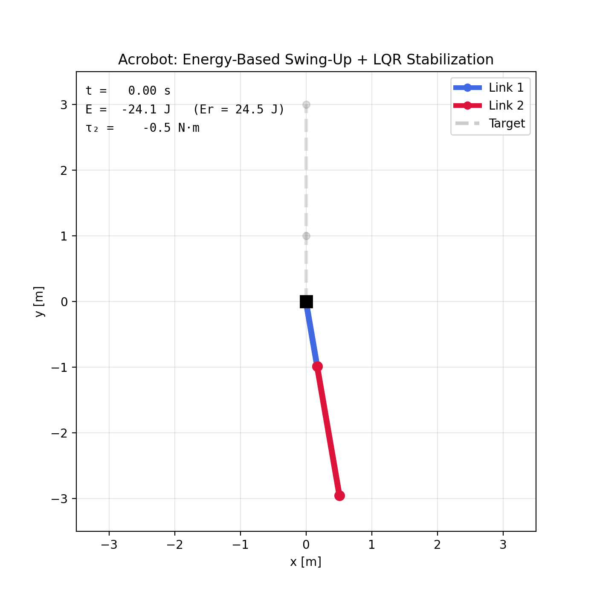
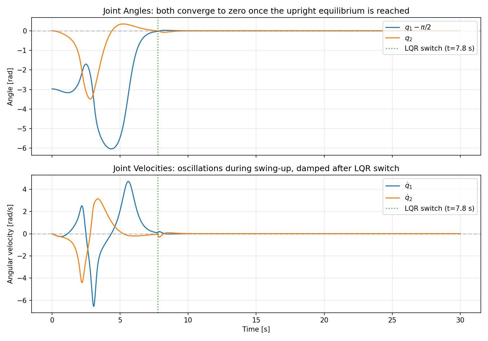
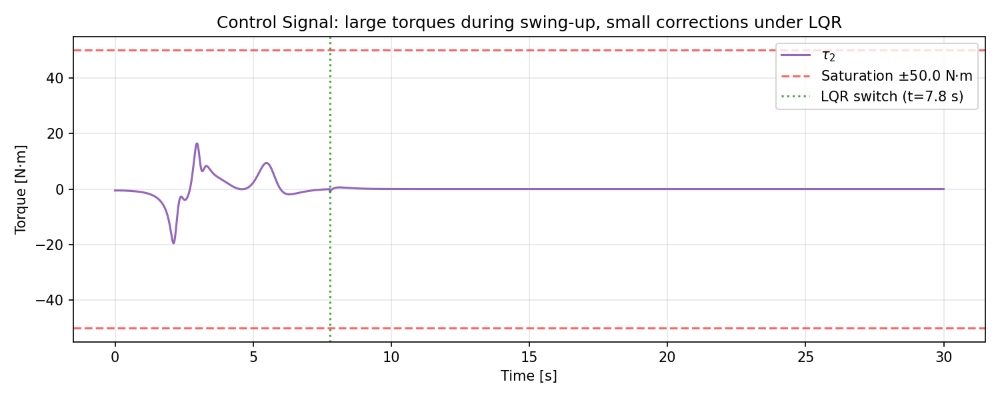
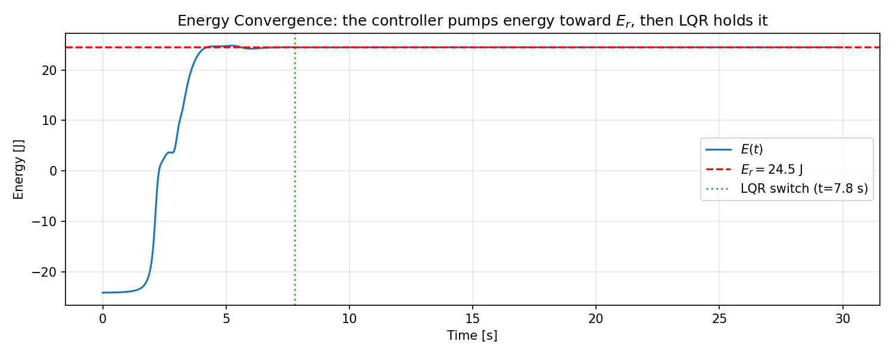
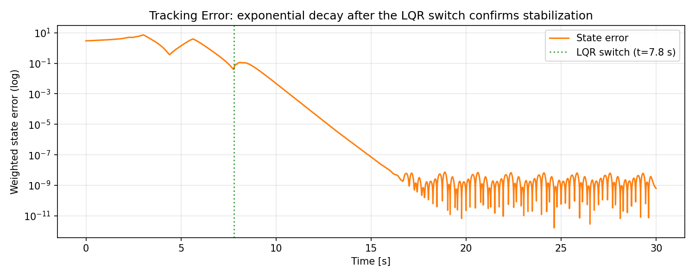
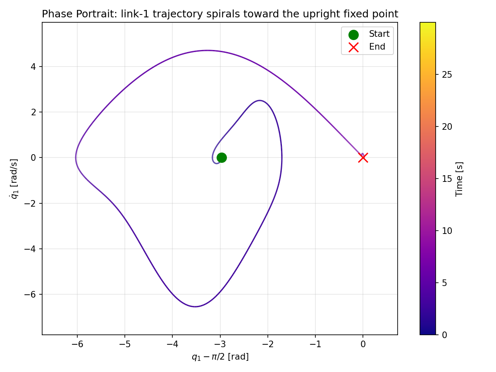

# Project 1: Energy-Based Swing-Up and LQR Stabilization of the Acrobot

<p align="center">
  
</p>
<p align="center"><em>
The acrobot swings from the hanging position to the upright equilibrium
using energy-based control, then holds it with LQR.
</em></p>

---

## 1. Problem Definition

**Control problem.** Swing a two-link underactuated planar robot (acrobot) from its
stable hanging equilibrium to the unstable upright equilibrium and stabilize it there,
using only a torque applied at the elbow joint.

**Plant.** The acrobot consists of two rigid links connected in series.
The shoulder joint (link 1 to the fixed pivot) is **unactuated**; only the
elbow joint (between link 1 and link 2) receives the control torque
$\tau_2$.

**Class of methods.** Energy-based (Lyapunov) control for the swing-up phase,
followed by linear-quadratic regulation (LQR) for terminal stabilization.

---

## 2. System Description

### 2.1 Schematic

```
        pivot (fixed)
          O
         /
        / link 1  (length l1, mass m1)
       /
      O ← elbow joint (actuated, torque τ₂)
       \
        \ link 2  (length l2, mass m2)
         \
          *
```

### 2.2 State Variables

| Symbol | Description | Unit |
|--------|-------------|------|
| $q_1$ | Angle of link 1 from horizontal, CCW positive | rad |
| $q_2$ | Relative angle of link 2 w.r.t. link 1 | rad |
| $\dot{q}\_1$ | Angular velocity of link 1 | rad/s |
| $\dot{q}\_2$ | Angular velocity of link 2 | rad/s |

State vector: $x = [q_1,\; q_2,\; \dot{q}\_1,\; \dot{q}\_2]^\top$.

**Equilibria:**

- Hanging (stable): $q_1 = -\pi/2,\; q_2 = 0,\; \dot{q} = 0$.
- Upright (unstable, target): $q_1 = \pi/2,\; q_2 = 0,\; \dot{q} = 0$.

### 2.3 Control Input

Scalar torque $\tau_2 \in [-u_{\max},\, u_{\max}]$ applied at the elbow joint.
The shoulder torque is identically zero: $\tau_1 = 0$ (underactuated).

### 2.4 Physical Parameters

| Parameter | Symbol | Value | Unit |
|-----------|--------|-------|------|
| Mass of link 1 | $m_1$ | 1.0 | kg |
| Mass of link 2 | $m_2$ | 1.0 | kg |
| Length of link 1 | $l_1$ | 1.0 | m |
| Length of link 2 | $l_2$ | 2.0 | m |
| COM distance, link 1 | $l_{c1}$ | 0.5 | m |
| COM distance, link 2 | $l_{c2}$ | 1.0 | m |
| Moment of inertia, link 1 | $I_1$ | 0.083 | kg m$^2$ |
| Moment of inertia, link 2 | $I_2$ | 0.33 | kg m$^2$ |
| Gravity | $g$ | 9.8 | m/s$^2$ |
| Torque limit | $u_{\max}$ | 50.0 | N m |

### 2.5 Equations of Motion

The standard manipulator equation is

$$
M(q)\,\ddot{q} + C(q,\dot{q})\,\dot{q} + G(q) = \begin{bmatrix} 0 \\\\ \tau_2 \end{bmatrix}
$$

with the following terms:

**Lumped parameters** (for convenience):

$$
\alpha_1 = m_1 l_{c1}^2 + m_2 l_1^2 + I_1, \quad \alpha_2 = m_2 l_{c2}^2 + I_2, \quad \alpha_3 = m_2 l_1 l_{c2}
$$

$$
\beta_1 = (m_1 l_{c1} + m_2 l_1)\,g, \quad \beta_2 = m_2 l_{c2}\,g
$$

**Inertia matrix:**

$$
M(q) = \begin{bmatrix} \alpha_1 + \alpha_2 + 2\alpha_3\cos q_2 & \alpha_2 + \alpha_3\cos q_2 \\\\ \alpha_2 + \alpha_3\cos q_2 & \alpha_2 \end{bmatrix}
$$

**Coriolis/centrifugal terms:**

$$
C(q,\dot{q})\,\dot{q} = \alpha_3\sin q_2 \begin{bmatrix} -2\dot{q}\_1\dot{q}\_2 - \dot{q}\_2^2 \\\\ \dot{q}\_1^2 \end{bmatrix}
$$

**Gravitational torques:**

$$
G(q) = \begin{bmatrix} \beta_1\cos q_1 + \beta_2\cos(q_1+q_2) \\\\ \beta_2\cos(q_1+q_2) \end{bmatrix}
$$

---

## 3. Method Description

The controller operates in two phases:

### 3.1 Phase 1 — Energy-Based Swing-Up

The total mechanical energy is

$$
E(q,\dot{q}) = \tfrac{1}{2}\dot{q}^\top M(q)\,\dot{q} + P(q), \qquad P(q) = \beta_1\sin q_1 + \beta_2\sin(q_1+q_2)
$$

At the upright equilibrium, the energy is $E_r = \beta_1 + \beta_2$.

**Lyapunov function candidate** (Xin & Kaneda, 2007):

$$
V = \tfrac{1}{2}(E - E_r)^2 + \tfrac{1}{2}k_D\,\dot{q}\_2^2 + \tfrac{1}{2}k_P\,q_2^2
$$

where $k_D, k_P > 0$.

**Derivation of the control law.** Differentiating $V$ along trajectories:

$$
\dot{V} = (E - E_r)\dot{E} + k_D\,\dot{q}\_2\,\ddot{q}\_2 + k_P\,q_2\,\dot{q}\_2
$$

Since $\tau_1 = 0$, the power input satisfies $\dot{E} = \dot{q}\_2\,\tau_2$, so

$$
\dot{V} = \dot{q}\_2\bigl[(E - E_r)\,\tau_2 + k_D\,\ddot{q}\_2 + k_P\,q_2\bigr]
$$

Setting the bracketed term equal to $-k_V\dot{q}\_2$ (with $k_V > 0$) ensures

$$
\dot{V} = -k_V\,\dot{q}\_2^2 \le 0
$$

To express $\ddot{q}\_2$ in terms of $\tau_2$, we eliminate $\ddot{q}\_1$ from the
manipulator equation using the first row ( $\tau_1 = 0$ ) and substitute into the
second row. Defining $\Delta = \det M(q) = M\_{11}M\_{22} - M\_{12}^2$, this yields:

$$
\tau_2 = -\frac{(k_V\dot{q}\_2 + k_P q_2)\,\Delta + k_D\bigl[M_{21}(H_1+G_1) - M_{11}(H_2+G_2)\bigr]}{k_D M_{11} + (E - E_r)\Delta}
$$

where $H_i = C_i(q,\dot{q})$ are the Coriolis terms.

**Solvability condition.** The denominator must be nonzero for all states.
This is guaranteed when

$$
k_D > \max_{q_2} \frac{\bigl(\sqrt{\beta_1^2 + \beta_2^2 + 2\beta_1\beta_2\cos q_2} + E_r\bigr)\,\Delta(q_2)}{M_{11}(q_2)} \approx 35.74
$$

We use $k_D = 35.8$ (margin 0.059).

**Convergence.** By LaSalle's invariance principle, the system converges to the
largest invariant set within $\lbrace\dot{q}\_2 = 0\rbrace$. Generically, all trajectories
(except a measure-zero set) converge to a neighborhood of the upright equilibrium.

### 3.2 Phase 2 — LQR Stabilization

Once the state is close to the upright, we linearize about $(q_1, q_2, \dot{q}\_1, \dot{q}\_2) = (\pi/2, 0, 0, 0)$:

$$
\dot{x} = A\,x + B\,u, \qquad x = \begin{bmatrix} q_1 - \pi/2 \\\\ q_2 \\\\ \dot{q}\_1 \\\\ \dot{q}\_2 \end{bmatrix}
$$

where

$$
A = \begin{bmatrix} 0 & 0 & 1 & 0 \\\\ 0 & 0 & 0 & 1 \\\\ -M_{\mathrm{eq}}^{-1}\,G_{\mathrm{jac}} & 0_{2\times 2} \end{bmatrix}, \qquad B = \begin{bmatrix} 0 \\\\ 0 \\\\ M_{\mathrm{eq}}^{-1}\begin{pmatrix}0 \\\\ 1\end{pmatrix}\end{bmatrix}
$$

The LQR gain $K$ is computed from the continuous algebraic Riccati equation (CARE):

$$
A^\top P + P A - P B R^{-1} B^\top P + Q = 0, \qquad K = R^{-1}B^\top P
$$

with $Q = \mathrm{diag}(10,\,10,\,1,\,1)$ and $R = 5$. The resulting gain is:

$$
K = [-238.6,\; -95.6,\; -103.0,\; -48.6]
$$

Control law: $u = -K\,x$, clipped to $[-u_{\max}, u_{\max}]$.

### 3.3 Switching Strategy

The simulation is split into two phases using ODE event detection:

1. Integrate with the energy-based controller.
2. An event triggers when the weighted state-error norm $\lVert e\rVert_w = |e_{q_1}| + |e_{q_2}| + 0.1|\dot{q}\_1| + 0.1|\dot{q}\_2|$ drops below a threshold $\epsilon = 0.04$.
3. From that instant, a fresh integration continues with the LQR controller.

This two-phase approach avoids mutable controller state inside the adaptive ODE solver,
which can cause premature or spurious switches due to rejected steps and intermediate stage evaluations.

---

## 4. Algorithm Listing

```
ALGORITHM: Acrobot Energy-Based Swing-Up with LQR Stabilization

Inputs:  x0 (initial state), T (sim time), ε (switch threshold), params
Outputs: state trajectory, control signal, energy

1. Compute lumped parameters α₁, α₂, α₃, β₁, β₂ from physical params.
2. Compute upright energy Er = β₁ + β₂.
3. Verify solvability: kD > max_{q₂} f(q₂).
4. Compute LQR gain K by solving the CARE for the linearized system.

5. PHASE 1 — Energy swing-up:
   For each ODE step (t, x):
     a. Compute E(x) = ½ dq^T M(q₂) dq + P(q).
     b. Compute M, C, G at current state.
     c. Compute τ₂ from the energy-based control law.
     d. Clip τ₂ to [-u_max, u_max].
     e. Return dx/dt = [dq₁, dq₂, M⁻¹(τ - C - G)].
   Terminate when ‖e‖_w < ε (event detection).

6. PHASE 2 — LQR stabilization:
   From the switch state x_sw:
     a. Compute error x_err = x - x_ref, wrap q₁ error to [-π, π].
     b. Compute τ₂ = -K x_err, clip to [-u_max, u_max].
     c. Return dx/dt as above.
   Integrate until t = T.

7. Concatenate trajectories. Compute control and energy at output points.
```

---

## 5. Experimental Setup

| Parameter | Value |
|-----------|-------|
| Initial state $x_0$ | $(-1.4,\; 0,\; 0,\; 0)$ — near hanging-down |
| Simulation time | 30 s |
| Output time step | 0.005 s |
| Energy gains $(k_D, k_P, k_V)$ | $(35.8,\; 61.2,\; 66.3)$ |
| LQR weights $(Q, R)$ | $(\mathrm{diag}(10,10,1,1),\; 5)$ |
| Torque saturation $u_{\max}$ | 50 N m |
| Switch threshold $\epsilon$ | 0.04 |
| ODE solver | RK45, rtol = atol = $10^{-8}$, max step 0.005 s |

---

## 6. Reproducibility

### Dependencies

```
pip install -r requirements.txt
```

Requires: `numpy`, `scipy`, `matplotlib`.

### Running

From the repository root:

```bash
# Full run (plots + animation GIF)
python -m src.main

# Plots only (skip animation, faster)
python -m src.main --no-anim
```

### Produced Outputs

| Output | Path |
|--------|------|
| State trajectories | `figures/state_trajectories.png` |
| Control signal | `figures/control_signal.png` |
| Energy convergence | `figures/energy.png` |
| Tracking error | `figures/tracking_error.png` |
| Phase portrait | `figures/phase_portrait.png` |
| Animation | `animations/acrobot_swingup.gif` |

---

## 7. Results Summary

### 7.1 State Trajectories

<p align="center"></p>

Both joint angles converge to zero (the upright reference) after the LQR switch at
$t \approx 7.8$ s. During the swing-up phase ($0$--$7.8$ s), the energy-based
controller produces large oscillations as it pumps energy into the system.
After the switch, the LQR rapidly damps all motion.

### 7.2 Control Signal

<p align="center"></p>

The torque stays well within the saturation bounds ($\pm 50$ N m).
Peak torques of $\sim$20 N m occur during the swing-up.
After the LQR switch, the control effort drops to near zero within a few seconds.

### 7.3 Energy Convergence

<p align="center"></p>

The total energy starts at $E_0 \approx -24.1$ J (hanging down) and is driven
toward $E_r = 24.5$ J (upright). The energy converges monotonically during swing-up,
consistent with the Lyapunov guarantee $\dot{V} = -k_V\dot{q}\_2^2 \le 0$.
After the LQR switch, energy is held constant at $E_r$.

### 7.4 Tracking Error

<p align="center"></p>

The weighted state error drops to $\sim 10^{-10}$ within $\sim$5 s of the LQR switch,
confirming exponential asymptotic stabilization at the upright equilibrium.

### 7.5 Phase Portrait

<p align="center"></p>

The phase portrait of link 1 shows the trajectory spiraling from the initial
condition (green dot) toward the upright fixed point (red cross at the origin),
with color encoding the passage of time.

### What Works

- The energy-based controller successfully pumps energy from $-24$ J to $24.5$ J in $\sim$8 s.
- The LQR switch is clean and occurs automatically via event detection.
- The LQR stabilizes the acrobot at the upright equilibrium with exponential convergence.
- All torques remain within the saturation bounds.

### Limitations

- The energy-based controller converges slowly near the equilibrium: the Lyapunov derivative $\dot{V} = -k_V\dot{q}\_2^2$ vanishes when $\dot{q}\_2 \to 0$, requiring the system to pass close to the upright with nonzero elbow velocity to trigger the switch.
- The solvability margin is small ($k_D - k_{D,\min} = 0.059$). Larger margins reduce the controller's authority near $E = E_r$, making it harder to reach the switch threshold.
- The switch threshold must be tuned carefully: too large and LQR saturates and diverges; too small and the energy-based controller never gets close enough.

---

## 8. References

1. Xin, X. & Kaneda, M. (2007). Analysis of the energy-based swing-up control of the Acrobot. *International Journal of Robust and Nonlinear Control*, 17, 1503--1524.
2. Fantoni, I., Lozano, R. & Spong, M. W. (2000). Energy based control of the Pendubot. *IEEE Transactions on Automatic Control*, 45(4), 725--729.
3. Slotine, J.-J. E. & Li, W. (1991). *Applied Nonlinear Control*. Prentice Hall.
