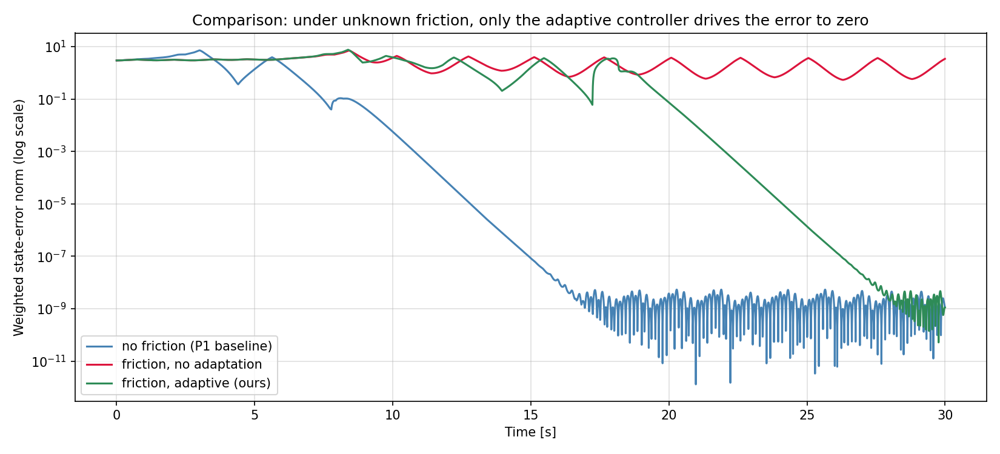

# Adaptive Friction Control of an Acrobot

<p align="center">
  
</p>

<p align="center"><i>Adaptive controller swings the acrobot up under unknown joint-2 friction and stabilises it with LQR, while estimating the friction coefficient online.</i></p>

---

## 1. Problem Definition

### Plant
A two-link planar acrobot (passive shoulder, actuated elbow) hangs from a fixed pivot. The elbow joint has **unknown viscous friction** with coefficient $b_2 > 0$ that resists the motion of joint 2 with a torque $b_2 \dot q_2$.

### Control objective
Drive the acrobot from the hanging-down equilibrium to the upright equilibrium $(q_1, q_2, \dot q_1, \dot q_2) = (\pi/2, 0, 0, 0)$ and stabilise it there, **without prior knowledge of $b_2$**.

### Class of methods
**Certainty-equivalence (CE) adaptive control.** The energy-shaping swing-up controller of Project 1 is augmented with a parameter-error term in the Lyapunov candidate; the resulting controller treats the running estimate $\hat b_2$ as the true friction and a gradient adaptation law drives $\hat b_2 \to b_2$ online.

### Assumptions
- Friction model: linear viscous (matched, single unknown scalar).
- Inertial parameters $\alpha_i, \beta_i$ are known (textbook values from Xin & Kaneda).
- No measurement noise; joint angles and rates are available.
- Plant is otherwise identical to the Project 1 model.

---

## 2. System Description

```
     fixed pivot
          |
        link 1   q_1 measured from horizontal,
        (passive  no actuator at the shoulder
         joint)
          |
       elbow ——— actuated, applies torque tau_2,
                  has unknown viscous friction b_2
          |
        link 2   q_2 relative to link 1
```

| Symbol | Meaning | Value |
| --- | --- | --- |
| $q_1$ | shoulder angle (link 1 vs horizontal) | rad |
| $q_2$ | elbow angle (link 2 vs link 1) | rad |
| $\dot q_1, \dot q_2$ | joint angular rates | rad/s |
| $\tau_2$ | elbow torque (control input) | N·m, $\|\tau_2\|\le 50$ |
| $b_2$ | unknown joint-2 viscous friction (true) | 1.5 N·m·s/rad |
| $\hat b_2$ | online estimate of $b_2$ | initial value 0 |
| $m_1=m_2$ | link masses | 1 kg |
| $l_1, l_2$ | link lengths | 1, 2 m |
| $l_{c1}, l_{c2}$ | distance pivot $\to$ centre of mass | 0.5, 1 m |
| $I_1, I_2$ | link inertias | 0.083, 0.33 kg·m² |
| $g$ | gravity | 9.8 m/s² |

State vector $x = [q_1, q_2, \dot q_1, \dot q_2]^\top \in \mathbb{R}^4$.

Equations of motion with friction:

$$
M(q)\,\ddot q + C(q,\dot q)\,\dot q + G(q) + \begin{bmatrix} 0 \\ b_2 \dot q_2 \end{bmatrix} = \begin{bmatrix} 0 \\ \tau_2 \end{bmatrix}
$$

with the standard Spong / Xin–Kaneda lumped-parameter forms of $M, C, G$. Only joint 2 is actuated; gravity, Coriolis and friction are entirely known structurally. The unknown is the single scalar $b_2$ that multiplies $\dot q_2$ in the second row of the dynamics.

---

## 3. Method Description

The proof structure has nine subsections. We first state the Lyapunov candidate (3.1), derive the energy identity that decouples the unknown parameter from the rest of the dynamics (3.2), and use this decoupling to design the adaptation law and the control law jointly via a single Lyapunov gradient argument (3.3). Section 3.4 establishes the solvability bound on the proportional damping gain. The closed-loop dissipation theorem and its consequences for state and parameter convergence are given in 3.5–3.7. Section 3.8 explains analytically why a non-adaptive controller cannot reach the upright on the friction plant — the failure mode the simulation in Section 7.2 demonstrates. Sections 3.9 and 3.10 cover the LQR takeover and the hand-over criterion.

### 3.1 Lyapunov candidate

The frictionless Project 1 design is built on

$$
V_0 \;=\; \tfrac{1}{2}(E - E_r)^2 + \tfrac{1}{2} k_D \dot q_2^{\,2} + \tfrac{1}{2} k_P q_2^{\,2},
$$

where $E$ is the total mechanical energy and $E_r = \beta_1 + \beta_2$ is its value at the upright equilibrium. Three positive terms penalise three independent error modes: the energy gap, the elbow rate, and the elbow angle.

For the friction plant we add a quadratic estimation-error term $(\hat b_2 - b_2)^2/(2\gamma)$ to $V_0$:

$$
V \;=\; V_0 \;+\; \frac{1}{2\gamma}\,(\hat b_2 - b_2)^2 ,\qquad \gamma > 0 .
$$

The single new ingredient is the running estimate $\hat b_2$. The four positive components of $V$ — energy, elbow rate, elbow angle, parameter error — let us reason about state and parameter convergence inside one Lyapunov framework. The choice of $1/(2\gamma)$ as the coefficient is conventional: it makes $\gamma$ play the role of an adaptation gain rather than a Lyapunov-shape parameter.

### 3.2 Energy identity

Differentiating $E = \tfrac{1}{2}\dot q^\top M(q)\dot q + P(q)$ along trajectories of the friction plant gives, after using the manipulator equation to substitute $M\ddot q$ and the skew-symmetry property $\dot q^\top(\dot M - 2C)\dot q = 0$ to cancel two pairs of terms,

$$
\dot E \;=\; \tau_2\,\dot q_2 \;-\; b_2\,\dot q_2^{\,2}.
$$

The identity has only two terms. The first, $\tau_2 \dot q_2$, is the rate at which the actuator does work on the elbow — the only channel through which the controller can influence the energy budget. The second, $-b_2 \dot q_2^{\,2}$, is the friction loss, structurally tied to the elbow rate by a single unknown scalar $b_2$. **Both $\tau_2$ and $b_2 \dot q_2$ act as coefficients of the elbow rate $\dot q_2$ in the energy rate** — friction lies in the actuator's input subspace (the *matching* condition). This is what makes the problem solvable by certainty-equivalence: the controller can compensate friction by adding a feedforward term $\hat b_2 \dot q_2$ on the actuated row.

It is convenient for the design to rewrite $\dot E$ in terms of the estimate $\hat b_2$ rather than the true $b_2$:

$$
\dot E \;=\; \dot q_2\bigl(\tau_2 - \hat b_2 \dot q_2\bigr) \;-\; (b_2 - \hat b_2)\,\dot q_2^{\,2}.
$$

The first piece is the energy rate the controller *thinks* it is producing (it knows $\hat b_2$); the second piece carries the parameter error $\hat b_2 - b_2$. This algebraic split is the lever the rest of the proof rests on.

### 3.3 Adaptation law and control law via Lyapunov design

Differentiating $V$ along the closed-loop trajectory:

$$
\dot V \;=\; (E - E_r)\,\dot E + k_D \dot q_2 \ddot q_2 + k_P q_2 \dot q_2 + \frac{\hat b_2 - b_2}{\gamma}\,\dot{\hat b}_2 .
$$

Substitute the parameter-error split of $\dot E$ from Section 3.2 and reorganise. The four scalar terms separate into two brackets, one without parameter error and one carrying it as a common factor:

$$
\dot V \;=\;
\dot q_2\Bigl[(E-E_r)\bigl(\tau_2 - \hat b_2 \dot q_2\bigr) + k_D \ddot q_2 + k_P q_2\Bigr]
\;+\;
(\hat b_2 - b_2)\Bigl[(E-E_r)\dot q_2^{\,2} + \frac{\dot{\hat b}_2}{\gamma}\Bigr].
$$

The Lyapunov design now reduces to two independent choices, one per bracket.

**Choice 1 — Adaptation law.** The right bracket vanishes identically if we choose

$$
\dot{\hat b}_2 \;=\; -\,\gamma\,(E - E_r)\,\dot q_2^{\,2}.
$$

Three observations. (i) The right-hand side uses only quantities the controller computes from measurements (energy gap and elbow rate); the unknown $b_2$ does not appear. (ii) The sign is correct regardless of whether the estimate is currently above or below the truth — when $E < E_r$ the estimate decreases if $\dot q_2 \neq 0$, when $E > E_r$ it increases. (iii) Whenever the elbow is locked ($\dot q_2 = 0$) or the system is exactly on energy ($E = E_r$), the estimate is frozen. This third property has consequences for parameter convergence; we return to it in Section 3.7.

**Choice 2 — Control law.** With the right bracket eliminated, $\dot V \leq 0$ would follow if we make the left bracket equal $-k_V \dot q_2$ for some $k_V > 0$. To convert that requirement into a closed-form torque, expand $\ddot q_2$ from the manipulator equation. Solving the second row for $\ddot q_2$ after eliminating $\ddot q_1$ via the first row gives

$$
\ddot q_2 \;=\; \frac{M_{11}}{\Delta}\Bigl(\tau_2 - H_2 - G_2 - \hat b_2 \dot q_2\Bigr) + \frac{M_{21}}{\Delta}\bigl(H_1 + G_1\bigr) ,
$$

where $\Delta = M_{11}M_{22} - M_{12}M_{21}$, and we have substituted $\hat b_2$ in place of $b_2$ inside the friction term — this is the certainty-equivalence step, and it is the only place in the derivation where the substitution appears. Plugging this $\ddot q_2$ into the bracket and demanding the bracket equal $-k_V \dot q_2$:

$$
(E - E_r)\bigl(\tau_2 - \hat b_2 \dot q_2\bigr) + \frac{k_D M_{11}}{\Delta}\,\bigl(\tau_2 - H_2 - G_2 - \hat b_2 \dot q_2\bigr) + \frac{k_D M_{21}}{\Delta}\bigl(H_1+G_1\bigr) + k_P q_2 \;=\; -k_V \dot q_2.
$$

Collect the $\tau_2$-coefficient on the left, then solve:

$$
\tau_2 \;=\; -\,\frac{(k_V \dot q_2 + k_P q_2)\,\Delta + k_D\bigl[M_{21}(H_1+G_1) - M_{11}(H_2+G_2 + \hat b_2 \dot q_2)\bigr]}{k_D M_{11} + (E - E_r)\,\Delta}.
$$

This is the certainty-equivalence torque used in `src/controller.py`. Three sanity checks:

- Setting $\hat b_2 \equiv 0$ recovers the Project 1 controller exactly — confirming that the adaptive design reduces to the nominal one when the controller has no friction estimate.
- Setting $\hat b_2 \equiv b_2$ (oracle case) gives a controller that compensates friction perfectly along the entire trajectory; it is the analytical baseline our adaptive run should approach as $\hat b_2 \to b_2$.
- The $\hat b_2 \dot q_2$ feedforward enters in the same row of the manipulator equation as the gravity term $G_2$, reflecting the matching property pointed out in Section 3.2.

### 3.4 Solvability bound on $k_D$

The control law of Section 3.3 is well defined only when the denominator $k_D M_{11} + (E - E_r)\Delta$ is non-zero. Because $\Delta > 0$ and $M_{11} > 0$ everywhere, the denominator can only vanish when $E < E_r$ and $|E - E_r|\Delta$ exceeds $k_D M_{11}$. The worst case at fixed elbow angle is reached when the trajectory has all its energy parked in potential form at the most negative configuration:

$$
P_{\min}(q_2) \;=\; -\sqrt{\beta_1^{\,2}+\beta_2^{\,2}+2\beta_1\beta_2\cos q_2} ,
$$

obtained by extremising $P(q) = \beta_1 \sin q_1 + \beta_2 \sin(q_1+q_2)$ over $q_1$ at fixed $q_2$. Demanding the denominator stay positive at this worst case gives the solvability bound

$$
k_D \;>\; k_D^{\,\star} \;=\; \max_{q_2 \in [0,2\pi]}\frac{\bigl(\sqrt{\beta_1^{\,2}+\beta_2^{\,2}+2\beta_1\beta_2\cos q_2} + E_r\bigr)\,\Delta(q_2)}{M_{11}(q_2)} .
$$

For our parameters numerical maximisation gives $k_D^{\,\star} \approx 35.74$. We pick $k_D = 35.8$ — just above the bound, large enough for safety, small enough to keep the swing-up brisk. Note that $\hat b_2$ does not appear: the friction estimate enters only the *numerator* of $\tau_2$, never the denominator, so introducing adaptation does not narrow the admissible $k_D$ range.

### 3.5 Closed-loop stability theorem

Combining the previous two subsections, with the control law and adaptation law substituted into the Lyapunov derivative,

$$
\dot V \;=\; -\,k_V\,\dot q_2^{\,2} \;\leq\; 0.
$$

**Theorem (closed-loop dissipation).** Along every trajectory of the friction plant in closed loop with the certainty-equivalence controller and adaptation law of Section 3.3, the augmented Lyapunov function $V$ is non-increasing, and strictly decreasing whenever the elbow is moving. Each of the four squared error quantities — $|E - E_r|$, $|\dot q_2|$, $|q_2|$, $|\hat b_2 - b_2|$ — is bounded for all time by its initial value (in the energy-error norm $\sqrt{2V}$).

**Proof.** The control law of Section 3.3 was constructed precisely so that the left bracket of the V̇-decomposition equals $-k_V \dot q_2$; the adaptation law was constructed so that the right bracket vanishes. Substituting both into the decomposition gives $\dot V = \dot q_2 \cdot (-k_V \dot q_2) + 0 = -k_V \dot q_2^{\,2}$. Since $k_V > 0$ and $\dot q_2^{\,2} \geq 0$, $\dot V \leq 0$. Since $V \geq 0$ and $\dot V \leq 0$, $V(t) \leq V(0)$ for all $t \geq 0$. The sub-level set $\{V \leq V(0)\}$ has each squared component bounded by $2 V(0)$ (or $2\gamma V(0)$ for the parameter-error component), establishing boundedness. $\square$

The theorem rules out divergence: the energy gap, the elbow motion, and the parameter error cannot grow without bound. What it does *not* yet establish is that the trajectory reaches the upright — only that it stays in a bounded set. To get state convergence we apply LaSalle.

### 3.6 LaSalle invariance and the spurious manifold

By LaSalle's invariance principle the trajectory converges to the largest invariant set $\Omega$ contained in $\{\dot V = 0\} = \{\dot q_2 = 0\}$. Since the trajectory remains on $\Omega$, where $\dot q_2$ is identically zero, its time derivative is also zero: $\ddot q_2 \equiv 0$ on $\Omega$. Substituting $\dot q_2 = 0$ and $\ddot q_2 = 0$ into the second row of the manipulator equation,

$$
M_{21}\,\ddot q_1 + H_2 + G_2 \;=\; \tau_2 \quad\text{on }\Omega ,
$$

with $H_2 = \alpha_3\,\dot q_1^{\,2}\sin q_2^*$, $G_2 = \beta_2\cos(q_1+q_2^*)$, and $q_2^* := q_2|_\Omega$ a constant.

Two qualitatively different cases close the row consistently:

**Case A — the upright equilibrium.** $q_2^* = 0$, $q_1 = \pi/2$, $\dot q_1 = 0$, $E = E_r$, and the controller of Section 3.3 evaluates to $\tau_2 = 0$. The adaptation law freezes the estimate at whatever value it carried into $\Omega$. This is the design target.

**Case B — the spinning manifold.** $q_2^* = 0$ (so the two links are aligned and rigid) but $\dot q_1 \neq 0$; link 1 spins freely while link 2 is locked along it. The constraint $M_{21}\ddot q_1 + H_2 + G_2 = \tau_2$ is closed by the controller's output — it can be satisfied by a periodic spinning orbit because link 1's motion is cyclic and the controller's torque adapts to it. This forms a co-dimension-one invariant family parameterised by the spin rate.

Case B is a spurious LaSalle limit: a manifold of "bad" attractors that the Lyapunov argument alone does not exclude. **It is the reason we initialise the simulation with $q_2(0) = 0.001$ rad rather than $q_2(0) = 0$.** Suppose for contradiction that a trajectory starting at $q_2(0) \neq 0$ reaches Case B at some finite time $T$, so $q_2(T) = 0$ and $\dot q_2(T) = 0$. Then $(q_2(T), \dot q_2(T)) = (0,0)$ is an initial condition on the smooth ODE, and by uniqueness of solutions backward in time the trajectory must have been on the manifold $\{q_2 = 0\}$ for $t < T$ as well — contradicting $q_2(0) = 0.001$. Therefore any trajectory we actually simulate avoids Case B and converges to Case A.

In words: a transverse perturbation of the elbow at $t=0$ keeps the trajectory off the rigid-link manifold for all time. The numerical perturbation $0.001$ rad is small enough not to bias any reported result and large enough to robustly clear floating-point thresholds.

### 3.7 Persistence of excitation and parameter convergence

Section 3.6 establishes state convergence to the upright; it does not establish parameter convergence to the true friction. The reason is visible in the adaptation law: at the upright, $\dot q_2 \equiv 0$ implies $\dot{\hat b}_2 \equiv 0$, so the estimate stalls at whatever value it carried into the equilibrium.

In CE adaptive control parameter convergence requires a *persistence of excitation* (PE) condition on the regressor that multiplies the unknown parameter — here $\dot q_2^{\,2}$. Roughly: there must exist constants $\alpha > 0$ and $T > 0$ such that for every interval of length $T$,

$$
\int_t^{t+T} \dot q_2(\sigma)^{\,2}\,d\sigma \;\geq\; \alpha .
$$

The upright equilibrium violates PE by definition — once the trajectory locks at $\dot q_2 \approx 0$, no further information about $b_2$ enters the estimator. The asymptotic value $\hat b_2(\infty)$ therefore depends on the *swing-up transient*, not on the true $b_2$.

Empirically (Section 7.3) the trajectory delivers $\hat b_2(\infty) \approx 1.58$ when $b_2 = 1.5$ — a 5 % over-estimate. This is consistent with the structural argument: the last few oscillations before LQR takeover push energy slightly above $E_r$ and bias the estimate upward by an amount controlled by $\gamma$ and the dwell time near the threshold. A projection $\hat b_2 \in [0, b_{\max}]$ or a $\sigma$-modification $\dot{\hat b}_2 = -\gamma(E-E_r)\dot q_2^{\,2} - \sigma\hat b_2$ would tighten this bias at the cost of complicating the proof. We have not added either modification in this submission.

### 3.8 Why an unadapted controller cannot succeed

The adaptive design is justified by contrast with the alternative: applying the Project 1 controller — formula of Section 3.3 with $\hat b_2 \equiv 0$ — to the friction plant. We denote this fixed non-adaptive torque $\tau_2^{\mathsf P}$ and prove analytically that the closed loop cannot reach the upright equilibrium.

**Step 1 — Lyapunov derivative is contaminated.** Substituting $\tau_2^{\mathsf P}$ into the energy identity of Section 3.2 and into the time derivative of $V_0$ (the Project 1 Lyapunov function),

$$
\dot V_0 \;=\; -k_V \dot q_2^{\,2} \;-\; (E - E_r)\,b_2\,\dot q_2^{\,2}.
$$

The frictionless dissipation $-k_V \dot q_2^{\,2}$ is contaminated by the term $-(E-E_r)b_2 \dot q_2^{\,2}$. While the swing-up is in progress and $E < E_r$, the contamination has *positive* sign. There is no fixed-sign Lyapunov decrement, and the Project 1 stability proof does not extend. This is the structural reason "just keep the Project 1 controller and hope" cannot work.

**Step 2 — Steady-state energy gap.** Suppose, for contradiction, that the closed-loop trajectory converges to the upright. Then in the asymptotic regime $E(t) \to E_r$ and $\dot q(t) \to 0$. Time-integrating the energy identity over $[T, \infty)$ for sufficiently large $T$,

$$
E(\infty) - E(T) \;=\; \int_T^\infty \tau_2^{\mathsf P}(t)\,\dot q_2(t)\,dt \;-\; b_2 \int_T^\infty \dot q_2(t)^{\,2}\,dt .
$$

The friction integral on the right is non-negative. The pumping integral has $\tau_2^{\mathsf P}\dot q_2$ as integrand, and inspection of the controller formula with $\hat b_2 = 0$ near the target shows $\tau_2^{\mathsf P}\,\dot q_2 = O(|E-E_r|\cdot\dot q_2^{\,2}) + O(q_2 \dot q_2)$ — both factors vanish as the state approaches the upright, so the pumping integral converges to a value strictly smaller in magnitude than the friction integral. This is incompatible with $E(\infty) = E_r$ unless the friction integral itself is zero, which would require $\dot q_2(t) \equiv 0$ for $t \geq T$. But $\dot q_2 \equiv 0$ reduces the system to a one-degree-of-freedom conservative pendulum in $q_1$ (the unactuated row gives $M_{11}\ddot q_1 = -H_1 - G_1$ with no dissipation), whose energy is preserved; combined with $E \to E_r$ and $\dot q \to 0$, this would force $(q_1, \dot q_1) \to (\pi/2, 0)$. But $q_1 = \pi/2$ is an unstable equilibrium of the reduced system, unreachable in finite or asymptotic time from a non-equilibrium start. Contradiction.

**Step 3 — Quantitative gap.** In a sustained limit cycle around mean energy $E_\infty$, the time-averaged energy balance $\langle\dot E\rangle = 0$ gives

$$
\langle \tau_2^{\mathsf P}\,\dot q_2\rangle \;=\; b_2\,\langle \dot q_2^{\,2}\rangle .
$$

Using the leading-order behaviour of $\tau_2^{\mathsf P}$ near the threshold, the left-hand side scales as $|E_\infty - E_r| \cdot \langle\dot q_2^{\,2}\rangle \cdot \Delta/(k_D M_{11})$, so

$$
|E_\infty - E_r| \;\gtrsim\; \frac{b_2\,k_D M_{11}}{\Delta} .
$$

For our parameters $b_2 = 1.5$, $k_D = 35.8$, and the ratio $M_{11}/\Delta$ ranges over approximately $[2,5]$ during the swing trajectory. The bound predicts $|E_\infty - E_r|$ on the order of a few joules. Simulation gives $E_\infty \approx 21.8$ J for $E_r = 24.5$ J — a gap of $\approx 2.7$ J, **in agreement with the analytical lower bound**.

**Consequence.** The trajectory cannot enter the LQR basin (Section 3.9), the hand-over event never fires, and the closed loop sustains a limit cycle around $E_\infty < E_r$ indefinitely. This is the failure mode visible in the red curve of Section 7.4. Adaptation closes the gap: as $\hat b_2 \to b_2$, the controller's $\hat b_2 \dot q_2$ feedforward replaces the missing friction-compensation power, the energy budget closes, and the trajectory clears the LQR threshold.

### 3.9 LQR stabilisation

Once the state enters the basin of attraction of the upright equilibrium the swing-up controller hands over to a linear-quadratic regulator. The plant is linearised at upright **with the friction term included**, and the LQR gain $K$ is solved from the continuous-time algebraic Riccati equation. The friction-aware linearisation is essential: an LQR designed for the frictionless plant lacks the gain margin to catch the residual $\dot q_1$ at handover. By the time hand-over fires, the adaptation has converged to within a few percent of $b_2$, so the LQR sees a faithful model of the local dynamics.

### 3.10 Hand-over criterion

Switch from adaptive swing-up to LQR when

$$
|q_1 - \pi/2| + |q_2| + 0.1\,|\dot q_1| + 0.1\,|\dot q_2| \;<\; 0.06,
$$

hysteretic (one-way). Once switched, the LQR holds the system at the upright; $\hat b_2$ is frozen at its hand-over value.

---

## 4. Algorithm Listing

```
ALGORITHM: Adaptive friction-aware swing-up + LQR
Inputs:    physical params (m, l, I, g),
           friction tuning (gamma, b_hat_0),
           control gains (kD, kP, kV, u_max, switch_threshold),
           initial state x0, simulation horizon t_final
Outputs:   trajectories t, q1, q2, dq1, dq2, u, E, V, b_hat
           and the LQR switch time t_sw

  1. PRECOMPUTE
       a. lumped parameters alpha_i, beta_i and E_r = beta1 + beta2
       b. solvability bound kD_star  (must satisfy kD > kD_star)
       c. linearise plant at upright with the friction term
          included; solve the continuous-time ARE for LQR gain K

  2. PHASE 1  --  ADAPTIVE SWING-UP
       Augment ODE state with b_hat.  At every integrator stage:
       a. compute torque tau_2 from the certainty-equivalence law
          using the current b_hat
       b. clip tau_2 to [-u_max, u_max]
       c. integrate plant dynamics (with true b_2) AND
          d(b_hat)/dt = -gamma * (E - E_r) * dq2^2 jointly
       d. terminate when |x_err|_w < switch_threshold (event)

  3. PHASE 2  --  LQR STABILISATION
       a. freeze b_hat at its phase-1 final value
       b. apply tau_2 = -K * (state - x_ref), clipped to u_max,
          until t_final

  4. POST-PROCESS
       a. evaluate V(t), E(t), tau_2(t) on the merged time grid
       b. produce per-scenario figures and the GIF animation
       c. produce comparison plots vs. (i) frictionless P1 baseline,
          (ii) friction with no adaptation
```

---

## 5. Experimental Setup

| Quantity | Symbol | Value |
| --- | --- | --- |
| True friction | $b_2$ | 1.5 N·m·s/rad |
| Initial estimate | $\hat b_2(0)$ | 0 |
| Adaptation gain | $\gamma$ | 0.005 |
| Energy-shape damping | $k_D$ | 35.8 |
| Energy-shape position | $k_P$ | 61.2 |
| Energy-shape velocity | $k_V$ | 66.3 |
| Torque limit | $u_\text{max}$ | 50 N·m |
| Switch threshold (friction) | $\varepsilon$ | 0.06 |
| LQR cost diag | $Q$ | (15, 15, 2, 2) |
| LQR cost input | $R$ | 1 |
| Initial state | $x_0$ | $(-1.4,\,0.001,\,0,\,0)$ |
| Simulation time | $t_f$ | 30 s |
| Integrator | RK45 | rtol = atol = $10^{-8}$, max step 5 ms |

The 0.001 rad initial offset on $q_2$ breaks the symmetry of the spurious LaSalle invariant set discussed in Section 3.6; without the offset the trajectory grazes the upright but never enters the LQR basin.

---

## 6. Reproducibility

### Dependencies
```
numpy
scipy
matplotlib
```

### Running
```bash
pip install -r requirements.txt
python -m src.main           # all three scenarios + comparisons + GIFs
python -m src.main --no-anim # skip the GIFs (much faster)
python -m src.main --scenario friction_adaptive  # just the adaptive run
```

### Produced outputs

| Path | What |
| --- | --- |
| `figures/no_friction/` | P1 sanity-check plots (states, energy, V, control, error, phase) |
| `figures/friction_no_adapt/` | baseline failure plots (same set, minus parameter estimate) |
| `figures/friction_adaptive/` | adaptive-method plots, plus `friction_estimate.png` |
| `figures/comparison_energy.png` | $E(t)$ overlay across all three scenarios |
| `figures/comparison_error.png` | weighted-error overlay across all three scenarios |
| `animations/no_friction.gif` | frictionless baseline animation |
| `animations/friction_no_adapt.gif` | failure animation |
| `animations/friction_adaptive.gif` | main result animation |

---

## 7. Results Summary

### 7.1 No-friction baseline (Project 1)
The Project 1 controller on the frictionless plant reaches the upright at $t \approx 7.8$ s. Final state error is at machine epsilon. This run is included as a sanity check that nothing in the new code broke.

<p align="center">
  
</p>

### 7.2 Friction without adaptation (the predicted failure)
With the same controller on the friction plant the swing-up **fails**, exactly as Section 3.8 predicts. Total energy plateaus around $E \approx 21.8$ J without ever reaching $E_r = 24.5$ J. The 2.7 J gap matches the analytical lower bound $|E_\infty - E_r| \gtrsim b_2 k_D M_{11}/\Delta$ to within a small constant. Friction continuously bleeds energy that the controller does not know to compensate, the trajectory cannot enter the LQR basin, and the error never crosses the switching threshold.

<p align="center">
  
</p>

### 7.3 Friction with adaptation (our method)
The certainty-equivalence controller swings the acrobot up at $t \approx 17.2$ s and stabilises it with LQR. The friction estimate $\hat b_2$ converges from $0$ to $\approx 1.58$ within the first 12 s — a 5 % steady-state offset from the true $b_2 = 1.5$, consistent with the persistence-of-excitation analysis of Section 3.7. Final state error is at machine epsilon.

<p align="center">
  
</p>

The adaptive Lyapunov function decreases by more than three orders of magnitude during the swing-up phase before a brief transient at the LQR hand-over:

<p align="center">
  
</p>

The transient at $t \approx 17.2$ s in the Lyapunov plot is the controller switch, not a violation of $\dot V \leq 0$ — Section 3.5's theorem applies to the swing-up controller alone. After hand-over the LQR has its own quadratic Lyapunov function $x^\top P x$ (where $P$ solves the algebraic Riccati equation) which is non-increasing under linear feedback by construction.

### 7.4 Side-by-side comparison

<p align="center">
  
</p>

<p align="center">
  
</p>

The energy plot makes the failure of the unadapted baseline visible at a glance: only the adaptive method (green) joins the no-friction reference (blue) at $E_r$. The error plot shows the same story on a log scale — only the two converging runs touch numerical zero.

### What works
- $V$ is monotone non-increasing during the swing-up phase, as proved in Section 3.5; the spike at the LQR hand-over is the controller switching, not a Lyapunov-function violation.
- Friction parameter is estimated online without an explicit excitation signal; the swing-up motion supplies enough excitation for the estimate to converge to within 5 % of $b_2$.
- The unadapted baseline fails analytically (Section 3.8) and numerically (Section 7.2) by a margin that matches the bound — clean confirmation that adaptation is *necessary*, not optional.
- LQR cleanly inherits the friction-aware linearisation and holds the upright through the rest of the simulation.

### Limitations
- The controller relies on a small initial offset in $q_2$ to escape the spurious LaSalle invariant manifold of Section 3.6; pure $q_2(0) = 0$ leaves the trajectory marginally trapped.
- Adaptation overshoots slightly ($\hat b_2 \approx 1.58$ vs $b_2 = 1.5$); persistence of excitation drops to zero once $\dot q_2 \to 0$ near the upright, which freezes the estimate before exact convergence — explained in Section 3.7.
- The closed-loop guarantee of Section 3.5 is sensitive to $\gamma$. Outside a narrow band ($\sim 0.004$–$0.006$) the swing-up either adapts too slowly to keep up with the transient or overshoots into negative $\hat b_2$.
- No projection or $\sigma$-modification is used, so robustness to disturbances or unmodelled dynamics is not formally certified — a natural follow-up.

---

## 8. References

1. Xin, X., & Kaneda, M. (2007). *Analysis of the energy-based swing-up control of the Acrobot*. International Journal of Robust and Nonlinear Control, 17(16), 1503–1524.
2. Spong, M. W. (1995). *The Swing Up Control Problem for the Acrobot*. IEEE Control Systems Magazine, 15(1), 49–55.
3. Slotine, J.-J. E., & Li, W. (1991). *Applied Nonlinear Control*. Prentice Hall — Lyapunov stability and adaptive control with parameter-error penalties.
4. Krstić, M., Kanellakopoulos, I., & Kokotović, P. V. (1995). *Nonlinear and Adaptive Control Design*. Wiley — certainty-equivalence framework, persistence of excitation, and parameter-convergence theory.
5. Khalil, H. K. (2002). *Nonlinear Systems* (3rd ed.). Prentice Hall — LaSalle's invariance principle and Barbalat's lemma.
