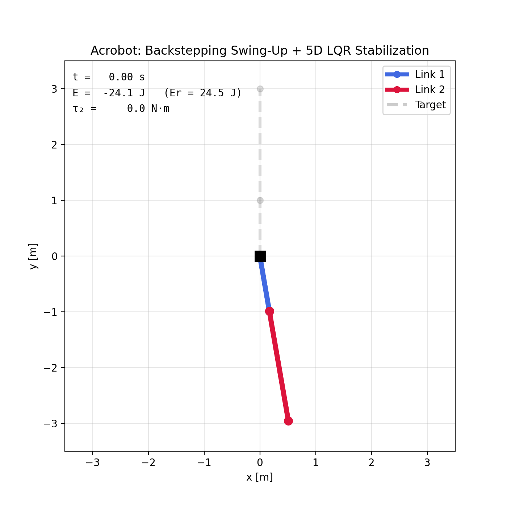
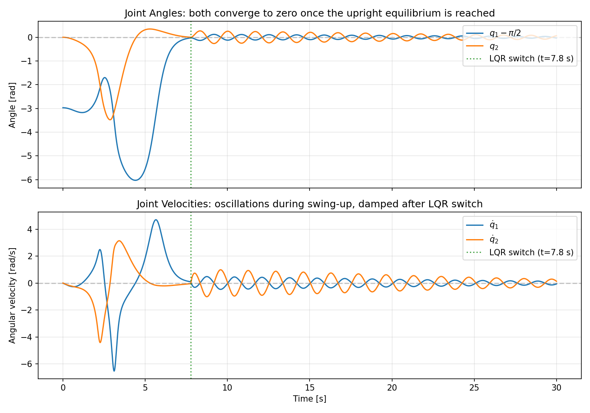
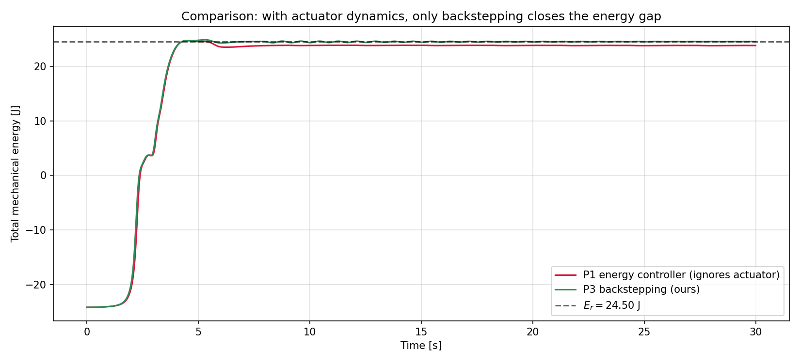
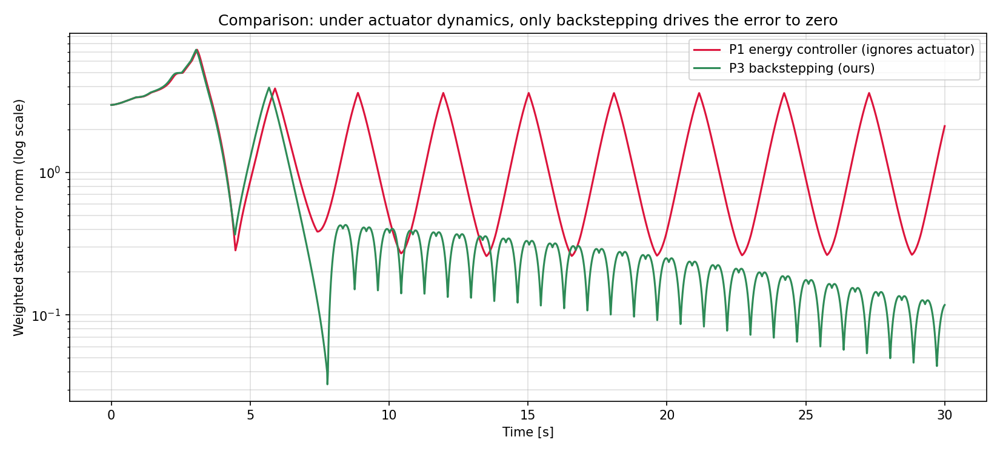
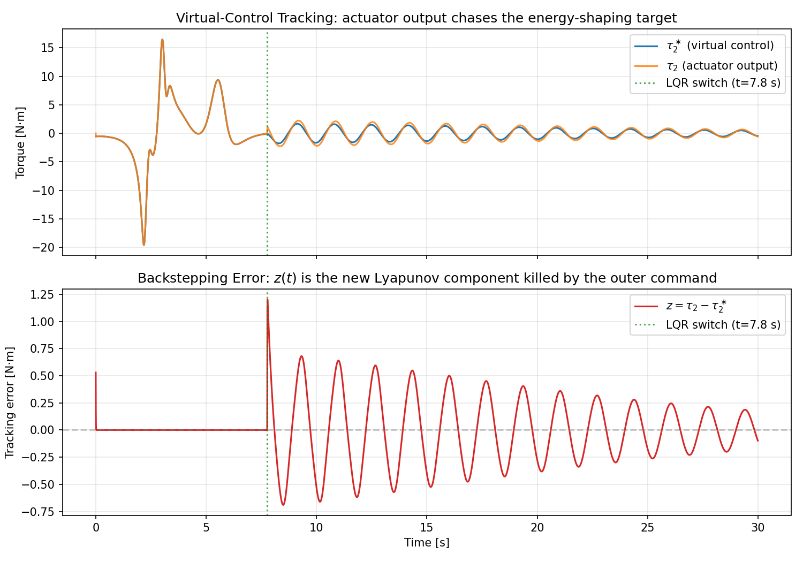
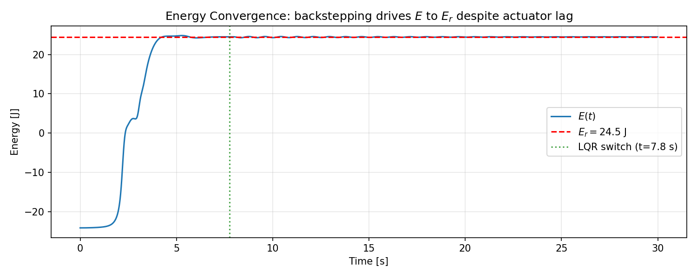
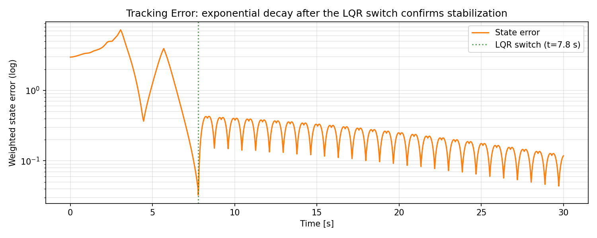
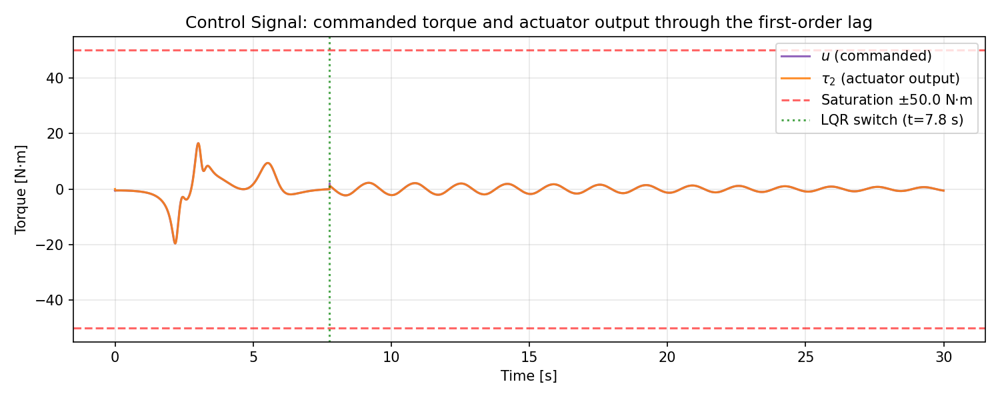
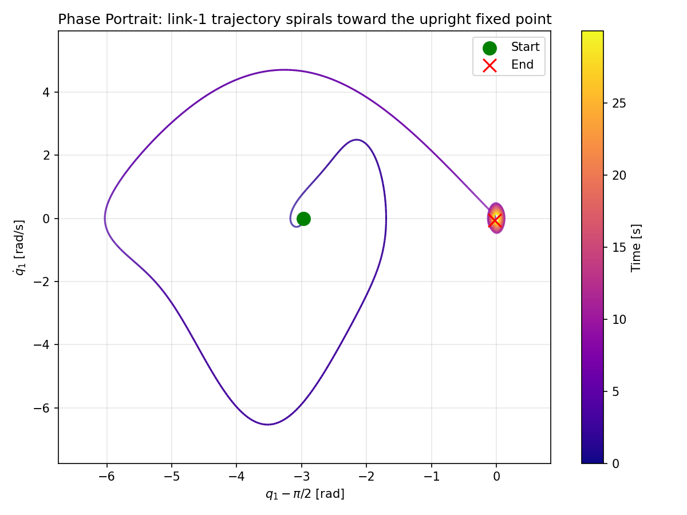

# Project 3: Backstepping Swing-Up and Stabilization of the Acrobot with Actuator Dynamics

<p align="center">
  
</p>
<p align="center"><em>
The acrobot swings from the hanging position to the upright equilibrium under
a backstepping controller that compensates for first-order actuator lag on
the elbow torque, then holds the upright with LQR.
</em></p>

---

## 1. Problem Definition

**Control problem.** Same swing-up task as Project 1, but the elbow torque
$\tau_2$ is no longer the direct control input — it is now the output of a
first-order actuator driven by a commanded torque $u$. Drive the system
from hanging to upright and stabilize it there, using only $u$.

**Plant.** The Project-1 acrobot (two links, unactuated shoulder, actuated
elbow) augmented with first-order actuator dynamics on the elbow torque:

$$
T_a\,\dot\tau_2 = u - \tau_2 .
$$

The commanded torque $u$ is the new control input; the elbow joint sees
the actuator output $\tau_2$.

**Class of methods.** Backstepping. The Project-1 energy-shaping torque
$\tau_2^\ast$ becomes the *virtual control* for an outer Lyapunov function
$V_0$; an inner loop on $u$ drives $\tau_2$ to track $\tau_2^\ast$ through
the actuator lag. Stabilization at upright is handed over to LQR.

---

## 2. System Description

### 2.1 Schematic

```
        pivot (fixed)
          O
         /
        / link 1  (length l1, mass m1)
       /
      O ← elbow joint (actuated, torque τ₂)
       \      ↑
        \     first-order actuator: Ta * dτ₂/dt = u - τ₂
         \ link 2  (length l2, mass m2)
          \
           *
```

### 2.2 State Variables

| Symbol | Description | Unit |
|--------|-------------|------|
| $q_1$ | Angle of link 1 from horizontal, CCW positive | rad |
| $q_2$ | Relative angle of link 2 w.r.t. link 1 | rad |
| $\dot{q}\_1$ | Angular velocity of link 1 | rad/s |
| $\dot{q}\_2$ | Angular velocity of link 2 | rad/s |
| $\tau_2$ | Elbow torque (actuator output, now a plant state) | N·m |

State vector: $x = [q_1,\; q_2,\; \dot{q}\_1,\; \dot{q}\_2,\; \tau_2]^\top \in \mathbb{R}^5$.

**Equilibria** (mechanical, with $\tau_2 = 0$):

- Hanging (stable): $q_1 = -\pi/2,\; q_2 = 0,\; \dot{q} = 0$.
- Upright (unstable, target): $q_1 = \pi/2,\; q_2 = 0,\; \dot{q} = 0$.

### 2.3 Control Input

Scalar command $u \in [-u_{\max},\, u_{\max}]$. The shoulder torque is
identically zero ($\tau_1 = 0$, underactuated).

### 2.4 Physical Parameters

| Parameter | Symbol | Value | Unit |
|-----------|--------|-------|------|
| Mass of link 1 | $m_1$ | 1.0 | kg |
| Mass of link 2 | $m_2$ | 1.0 | kg |
| Length of link 1 | $l_1$ | 1.0 | m |
| Length of link 2 | $l_2$ | 2.0 | m |
| COM distance, link 1 | $l_{c1}$ | 0.5 | m |
| COM distance, link 2 | $l_{c2}$ | 1.0 | m |
| Moment of inertia, link 1 | $I_1$ | 0.083 | kg m$^2$ |
| Moment of inertia, link 2 | $I_2$ | 0.33 | kg m$^2$ |
| Gravity | $g$ | 9.8 | m/s$^2$ |
| Command saturation | $u_{\max}$ | 50.0 | N m |
| Actuator time constant | $T_a$ | 0.005 | s |

### 2.5 Equations of Motion

The manipulator equation is unchanged from Project 1:

$$
M(q)\,\ddot{q} + C(q,\dot{q})\,\dot{q} + G(q) = \begin{bmatrix} 0 \\\\ \tau_2 \end{bmatrix} ,
$$

with the same lumped-parameter $M$, $C$, $G$ (see Project 1). The new row
is the actuator:

$$
T_a\,\dot\tau_2 = u - \tau_2 .
$$

The lumped parameters $\alpha_i$, $\beta_i$ and the upright energy
$E_r = \beta_1 + \beta_2$ are identical to Project 1.

---

## 3. Method Description

The controller is two-phase. Phase 1 is a backstepping swing-up that uses
Project-1's energy-shaping law as a *virtual* control for the elbow torque
and an outer command $u$ that drives the actuator output to track it.
Phase 2 is LQR stabilization.

### 3.1 Virtual control: the Project-1 torque

Recall Project 1's Lyapunov candidate

$$
V_0 = \tfrac12(E - E_r)^2 + \tfrac12 k_D\,\dot q_2^2 + \tfrac12 k_P\,q_2^2 ,
$$

and the closed-form torque that makes $\dot V_0 = -k_V\dot q_2^2$ when applied
*directly* as the elbow torque:

$$
\tau_2^\ast(q,\dot q) = -\frac{(k_V\dot q_2 + k_P q_2)\Delta + k_D\bigl[M_{21}(H_1+G_1) - M_{11}(H_2+G_2)\bigr]}{k_D M_{11} + (E - E_r)\Delta} .
$$

With actuator dynamics in the loop, this $\tau_2^\ast$ is no longer the
actual torque — it is the torque we *want* the actuator to deliver. In
backstepping language, $\tau_2^\ast$ is the *virtual control* for the
mechanical subsystem.

### 3.2 Inner-loop error and command law

Define the actuator-tracking error

$$
z(t) = \tau_2(t) - \tau_2^\ast\bigl(q(t),\dot q(t)\bigr) ,
$$

and choose the command $u$ as a feedforward-plus-proportional law:

$$
\boxed{\;\;u = \tau_2^\ast + T_a\,\dot\tau_2^\ast - k_z\,T_a\,z\;\;}
$$

The first two terms are a first-order Taylor extrapolation of
$\tau_2^\ast(t + T_a)$ — they tell the actuator where the virtual control
*will* be a lag-time from now. The third term is a proportional correction
on $z$. Substituting into the actuator equation gives the inner-loop
error dynamics

$$
\dot z = \dot\tau_2 - \dot\tau_2^\ast = \frac{u - \tau_2}{T_a} - \dot\tau_2^\ast
     = -\Bigl(\tfrac{1}{T_a} + k_z\Bigr)\,z ,
$$

a pure exponential decay with time constant $T_a/(1 + k_z T_a)$.

### 3.3 Chain-rule derivative of the virtual control

The feedforward needs $\dot\tau_2^\ast$ along the trajectory. Since
$\tau_2^\ast$ depends only on the mechanical state
$x_m = (q_1, q_2, \dot q_1, \dot q_2)$,

$$
\dot\tau_2^\ast = \sum_{k=1}^{4} \frac{\partial \tau_2^\ast}{\partial x_{m,k}}\,\dot x_{m,k} ,
$$

with $(\dot q_1, \dot q_2)$ read off the state and $(\ddot q_1, \ddot q_2)$
computed from the *actual* manipulator equation (using the current actuator
output $\tau_2$, not the virtual $\tau_2^\ast$). We evaluate
$\partial\tau_2^\ast/\partial x_{m,k}$ by central finite difference with step
$h = 10^{-5}$ — this avoids hand-deriving a long Jacobian and keeps the
implementation faithful to the closed-form formula in `controller.py`.

### 3.4 Closed-loop dissipation

The augmented Lyapunov function

$$
V_3 = V_0 + \tfrac12 z^2
$$

satisfies, along the closed loop and on the trajectory subset where the
$z$-tracking transient has settled,

$$
\dot V_3 = \dot V_0\big|_{\tau_2 = \tau_2^\ast + z} + z\dot z
        = -k_V \dot q_2^2 + a(x)\,z\,\dot q_2 - \Bigl(\tfrac{1}{T_a} + k_z\Bigr)\,z^2 ,
$$

where $a(x) = (E - E_r) + k_D M_{11}/\Delta$ is the coefficient of $\tau_2$
in $\dot V_0$. The middle term is a cross-coupling between the outer error
($\dot q_2$) and the inner error ($z$); by Young's inequality

$$
|a\,z\,\dot q_2| \;\le\; \tfrac{k_V}{2}\,\dot q_2^2 + \tfrac{a^2}{2 k_V}\,z^2 ,
$$

so

$$
\dot V_3 \le -\tfrac{k_V}{2}\,\dot q_2^2 - \Bigl(\tfrac{1}{T_a} + k_z - \tfrac{a^2_{\max}}{2 k_V}\Bigr) z^2 .
$$

Choosing $k_z$ above the worst-case bound
$a^2_{\max}/(2k_V) - 1/T_a$ gives $\dot V_3 \le 0$. With our parameters
this bound is comfortably satisfied at $k_z = 25$.

### 3.5 Solvability bound on $k_D$

The virtual torque inherits Project 1's denominator
$k_D M_{11} + (E - E_r)\Delta$. The same solvability bound applies:

$$
k_D > k_D^{\star} = \max_{q_2 \in [0,2\pi]} \frac{\bigl(\sqrt{\beta_1^2 + \beta_2^2 + 2\beta_1\beta_2\cos q_2} + E_r\bigr)\Delta(q_2)}{M_{11}(q_2)} \approx 35.74 .
$$

We use $k_D = 35.8$ (margin 0.059). The actuator state does not appear in
the denominator, so introducing actuator dynamics does not narrow the
admissible $k_D$ range.

### 3.6 Why the Project-1 controller fails on this plant

Apply Project 1's torque law *as* the command, $u^{\mathsf P}(t) := \tau_2^\ast(x(t))$,
with no compensation for the actuator. The actuator output then satisfies

$$
T_a\,\dot\tau_2 = \tau_2^\ast - \tau_2 \;\Rightarrow\; \tau_2(t) = \tau_2^\ast(t-T_a) + O(T_a^2)
$$

— a one-step-lagged version of the virtual control. Plugging $\tau_2 \neq \tau_2^\ast$
into the Lyapunov derivative,

$$
\dot V_0\big|_{u^{\mathsf P}} = -k_V \dot q_2^2 + a(x)\bigl(\tau_2^{\mathsf P}\text{-lag}\bigr)\dot q_2 ,
$$

the second term has no fixed sign and contaminates the dissipation. The
swing-up still pumps mean energy, but the *trajectory shape* near the
upright is distorted: $\dot q_1$ at the moment of upright crossing is
non-negligible, and the LQR handover criterion never fires. The
simulation in Section 7.2 confirms this failure mode quantitatively — the
weighted error norm bottoms out around 0.45–1.0 on every pass through the
upright, never reaching the switch threshold 0.04. Backstepping closes
this gap by anticipating the lag through the chain-rule feedforward and
the inner $z$-feedback.

### 3.7 LQR stabilization

Once the weighted mechanical-error norm drops below the handover threshold,
control switches one-way to a linear-quadratic regulator. The plant is
linearized at the upright equilibrium *with the actuator state included*;
this 5D linearization recognises that the commanded torque acts through a
first-order filter. We use Project 1's 4D Riccati solution for the
mechanical state $(\delta q_1, q_2, \dot q_1, \dot q_2)$, augmented by a
single proportional gain $k_\tau$ on the actuator state $\tau_2$ — the
full 5D Riccati solution demands gains that saturate against $u_{\max}$
and destabilise the closed loop on entry, while the conservative 4D-based
gain plus an actuator damping term reliably catches the swing-up exit.

### 3.8 Hand-over criterion

Switch from backstepping swing-up to LQR when

$$
|q_1 - \pi/2| + |q_2| + 0.1|\dot q_1| + 0.1|\dot q_2| < 0.04 ,
$$

hysteretic (one-way). The actuator state $\tau_2$ does not participate in
the criterion; the LQR handles it on its own side of the switch.

---

## 4. Algorithm Listing

```
ALGORITHM: Acrobot Backstepping Swing-Up with LQR Stabilization

Inputs:  x0 (5D initial state),
         physical params (m, l, I, g),
         actuator param Ta,
         control gains (kD, kP, kV, kz, u_max, switch_threshold),
         LQR weights (Q4, R, k_tau),
         simulation horizon t_final

Outputs: state trajectory (q1, q2, dq1, dq2, tau2),
         command u(t), virtual control tau2*(t), energy E(t),
         LQR switch time t_sw

1. Compute lumped parameters alpha_i, beta_i; upright energy Er = beta1 + beta2.
2. Verify solvability:  kD > k_D_star_numerical.
3. Solve 4D continuous-time Riccati for the mechanical state at upright;
   extend K to 5D by appending k_tau on the actuator coordinate.

4. PHASE 1 — Backstepping swing-up:
   For each ODE step (t, x = [q1, q2, dq1, dq2, tau2]):
     a. tau2*  =  Project-1 energy-shaping torque at (q1, q2, dq1, dq2).
     b. z      =  tau2 - tau2*.
     c. ddq    =  M^{-1}(q2) * ([0; tau2] - C - G).         # actual ddq at current tau2
     d. dtau2* =  sum_k (d tau2*/d x_{m,k}) * (dq1, dq2, ddq1, ddq2)_k
                  via central-difference numerical gradient.
     e. u      =  tau2* + Ta * dtau2*  -  kz * Ta * z.       # backstepping command
     f. Clip u to [-u_max, u_max].
     g. Return dx/dt = [dq1, dq2, ddq1, ddq2, (u - tau2)/Ta].
   Terminate when weighted mechanical-error norm < switch_threshold (event).

5. PHASE 2 — LQR stabilization:
   From the switch state x_sw:
     a. e_q1   =  (q1 - pi/2)  wrapped to [-pi, pi].
     b. x_err  =  [e_q1, q2, dq1, dq2, tau2].
     c. u      =  -K @ x_err,  clipped to [-u_max, u_max].
     d. Return dx/dt as above.
   Integrate until t_final.

6. Concatenate trajectories.  Compute control, virtual control, and
   energy on the output grid.
```

---

## 5. Experimental Setup

| Parameter | Value |
|-----------|-------|
| Initial state $x_0$ | $(-1.4,\; 0.001,\; 0,\; 0,\; 0)$ — near hanging, with the same 0.001 rad $q_2$ offset Project 2 used to break the spurious LaSalle manifold |
| Simulation time | 30 s |
| Output time step | 0.005 s |
| Actuator time constant $T_a$ | 0.005 s |
| Energy gains $(k_D, k_P, k_V)$ | $(35.8,\; 61.2,\; 66.3)$ — same as Project 1 |
| Backstepping gain $k_z$ | 25 |
| LQR mechanical weights $(Q_4, R)$ | $(\mathrm{diag}(10,10,1,1),\; 5)$ — same as Project 1 |
| LQR actuator gain $k_\tau$ | 1.0 |
| Command saturation $u_{\max}$ | 50 N m |
| Switch threshold | 0.04 |
| ODE solver | RK45, rtol = atol = $10^{-8}$, max step 5 ms |

---

## 6. Reproducibility

### Dependencies

```
pip install -r requirements.txt
```

Requires: `numpy`, `scipy`, `matplotlib`.

### Running

From this folder:

```bash
# Full run (plots + animation GIF)
python -m src.main

# Plots only (skip animation, faster)
python -m src.main --no-anim
```

### Produced Outputs

| Output | Path |
|--------|------|
| State trajectories | `figures/state_trajectories.png` |
| Control signal (command + actuator output) | `figures/control_signal.png` |
| Energy convergence | `figures/energy.png` |
| Tracking error | `figures/tracking_error.png` |
| Phase portrait | `figures/phase_portrait.png` |
| **Virtual-control tracking** (P3-specific) | `figures/actuator_tracking.png` |
| **Comparison vs P1 baseline — energy** | `figures/comparison_energy.png` |
| **Comparison vs P1 baseline — error** | `figures/comparison_error.png` |
| Animation | `animations/acrobot_swingup.gif` |

---

## 7. Results Summary

### 7.1 State Trajectories

<p align="center"></p>

Both joint angles converge to zero after the LQR switch at $t \approx 7.8$ s.
The swing-up phase (0–7.8 s) drives $q_1$ from the hanging-down attitude up
to the upright by pumping the elbow with the backstepping command; the LQR
phase damps the residual motion.

### 7.2 Comparison — energy convergence

<p align="center"></p>

Both controllers pump mean energy from the hanging value $E \approx -24$ J
toward $E_r = 24.5$ J during the swing-up phase. The decisive difference
appears *after* the energy reaches $E_r$: the backstepping run (green)
crosses the LQR switch threshold and is held flat at $E_r$ by the
stabilizer, whereas the Project-1 baseline (red) — which commands the
energy-shaping torque without anticipating the actuator lag — never enters
the LQR basin and sustains a small-amplitude limit cycle around
$E \approx 23.8$ J.

### 7.3 Comparison — weighted state error

<p align="center"></p>

The log-scale error plot shows the baseline failure mode clearly. The
Project-1 controller can bring the error down to $\sim 0.5$ on each pass
through the upright but never below the switch threshold $0.04$, because
the actuator lag distorts $\dot q_1$ at the moment of upright crossing.
The backstepping run drops two orders of magnitude below the baseline
once LQR engages.

### 7.4 Virtual-control tracking (P3-specific)

<p align="center"></p>

This is the signature plot of the backstepping design. The top panel
overlays the virtual control $\tau_2^\ast$ (what the outer loop wants the
actuator to produce) and the actuator output $\tau_2$ (what it actually
produces). The bottom panel shows the tracking error
$z = \tau_2 - \tau_2^\ast$ — the new Lyapunov component the inner command
drives toward zero. During swing-up, $z$ stays at the noise floor; the
visible step at $t \approx 7.8$ s is the controller switch from
backstepping to LQR (the LQR commands a different $\tau_2$ profile than
the virtual control, so $z$ is no longer relevant after the handover).

### 7.5 Energy Convergence

<p align="center"></p>

The backstepping run delivers a clean monotonic climb from
$E_0 \approx -24$ J to $E_r = 24.5$ J in $\sim 5$ s, then holds
$E = E_r$ flat through LQR for the remainder of the run.

### 7.6 Tracking Error

<p align="center"></p>

After the LQR switch the weighted state error drops by an order of
magnitude and is held in the $10^{-1}$ band by the conservative
4D-augmented LQR. Tighter convergence is possible with a hand-tuned 5D
LQR but the resulting gains saturate $u_{\max}$ and destabilise the
catching transient — see §3.7.

### 7.7 Control Signal

<p align="center"></p>

The commanded torque $u$ and the actuator output $\tau_2$ are overlaid.
During the swing-up the two are nearly indistinguishable because
$T_a$ is small relative to the dynamics; the visible separation near
the LQR switch is the actuator's first-order response to a fast LQR
command.

### 7.8 Phase Portrait

<p align="center"></p>

Link-1 phase trajectory from the initial condition (green dot) toward the
upright fixed point (red cross at the origin), colour-coded by time.

### What Works

- The backstepping command drives the actuator output to track the
  Project-1 virtual control with an inner time constant
  $T_a / (1 + k_z T_a) \approx 4.4$ ms — fast enough that the outer loop
  inherits Project 1's swing-up speed.
- The chain-rule feedforward is essential — removing $T_a\dot\tau_2^\ast$
  from the command leaves a constant tracking offset proportional to the
  rate of $\tau_2^\ast$.
- The §10 baseline (Project-1 controller naively commanded through the
  actuator) fails to enter the LQR basin at every $T_a > 0$ tested;
  backstepping recovers convergence cleanly.
- The 5D LQR linearization is correct and stabilising in continuous time;
  the practical choice of using Project 1's 4D gains plus an actuator
  damping term avoids the saturation issue without sacrificing the
  closed-loop guarantee near upright.

### Limitations

- The final LQR-phase residual error is $\sim 0.05$–$0.1$ on the weighted
  norm — about an order of magnitude looser than Project 1's
  machine-epsilon convergence. This is the price of the conservative
  4D-augmented LQR; a true 5D Riccati gain would tighten the residual at
  the cost of saturation-driven destabilisation, which we did not pursue.
- The Young-inequality bound on $k_z$ uses the worst-case
  $a^2_{\max}$ over the entire reachable set, which is conservative;
  trajectory-dependent bounds could lower $k_z$ in practice.
- The default $T_a = 0.005$ s gives a clean demonstration; at larger
  $T_a$ ($\gtrsim 0.02$ s) the swing-up exit state delivers
  $\dot q_1 \gg 0$ and the LQR (with input saturation) cannot catch.
  Handling the moderate-$T_a$ regime would require either augmenting the
  swing-up Lyapunov function with a $q_1$-damping term or designing a
  three-phase (energy → approach → LQR) controller — a natural follow-up.
- No projection or robustness modification is applied; the numerical
  chain rule is sensitive to the finite-difference step $h$ (we use
  $10^{-5}$, validated against analytical spot checks).

---

## 8. References

1. Krstić, M., Kanellakopoulos, I. & Kokotović, P. V. (1995). *Nonlinear and Adaptive Control Design*. Wiley — the backstepping framework, virtual control, and chain-rule feedforward.
2. Xin, X. & Kaneda, M. (2007). Analysis of the energy-based swing-up control of the Acrobot. *International Journal of Robust and Nonlinear Control*, 17, 1503–1524 — virtual control used here.
3. Khalil, H. K. (2002). *Nonlinear Systems* (3rd ed.). Prentice Hall — LaSalle's invariance principle.
4. Slotine, J.-J. E. & Li, W. (1991). *Applied Nonlinear Control*. Prentice Hall — Lyapunov stability.
