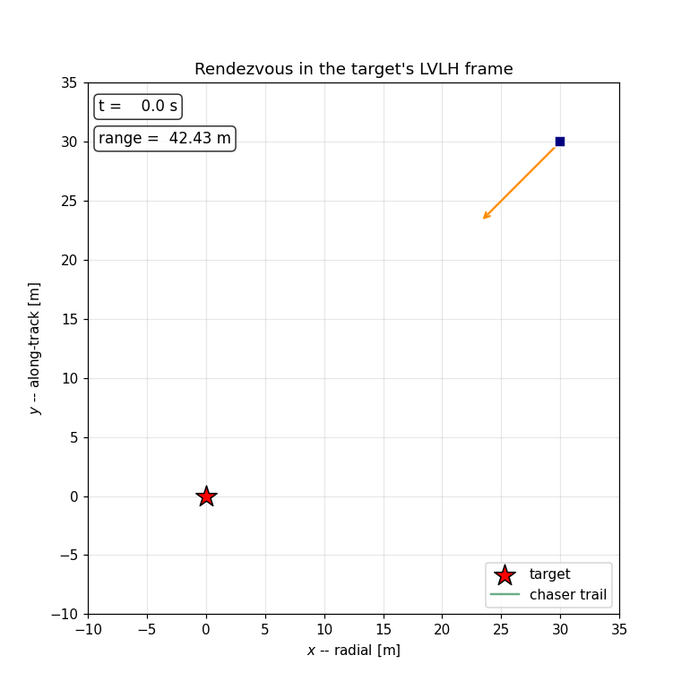
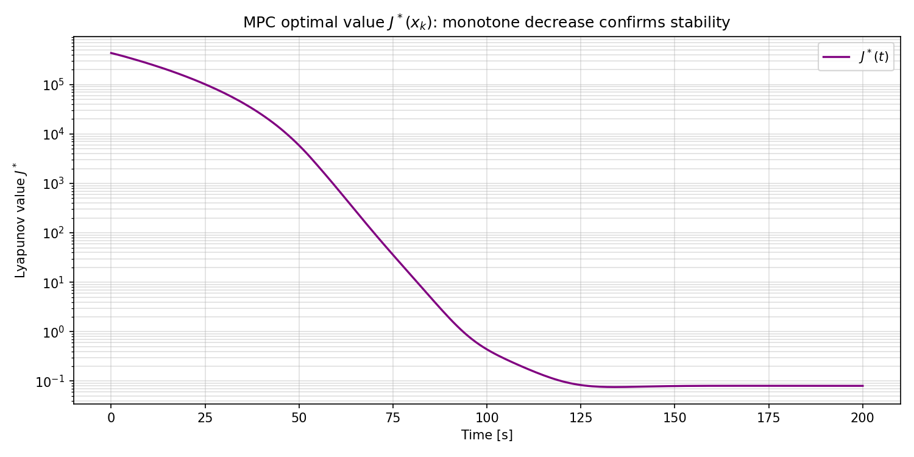
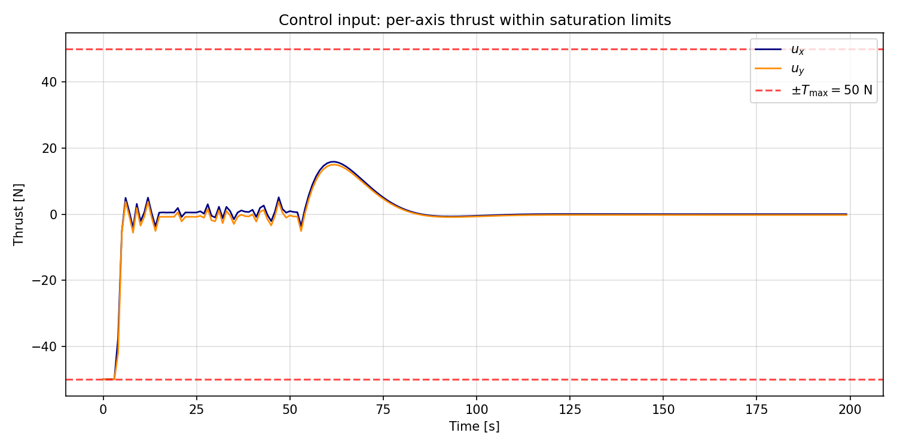
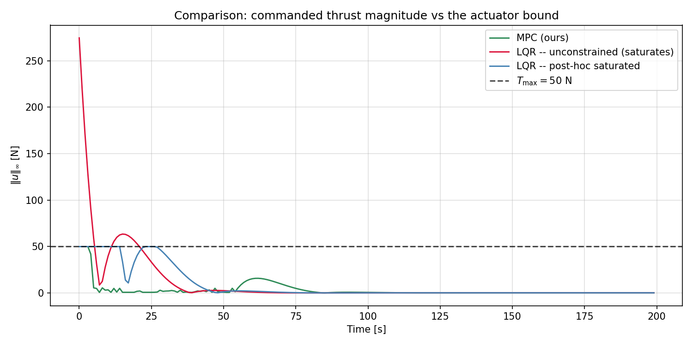
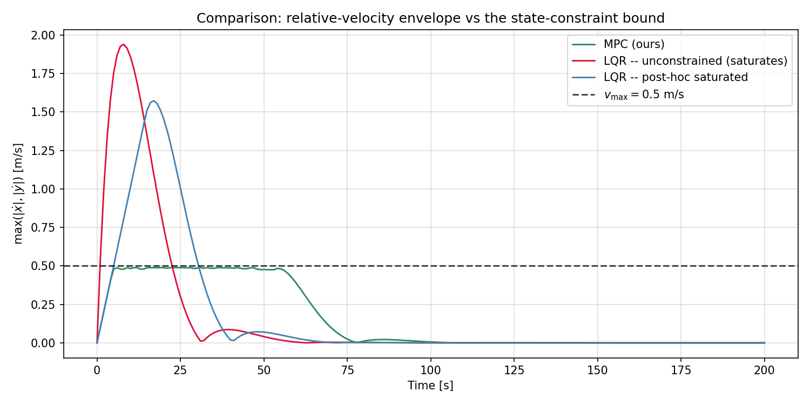
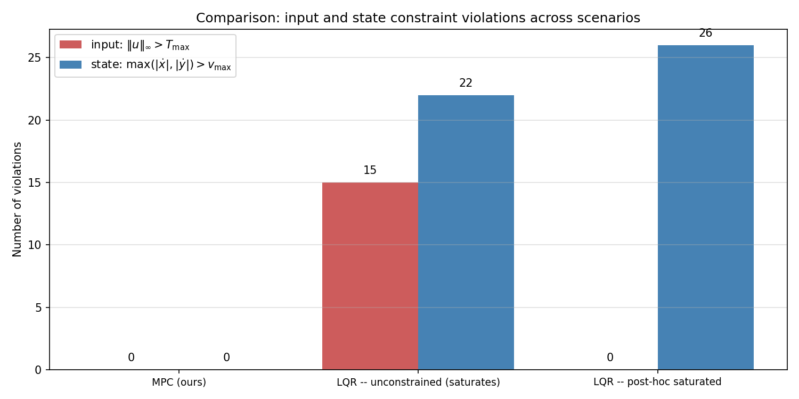
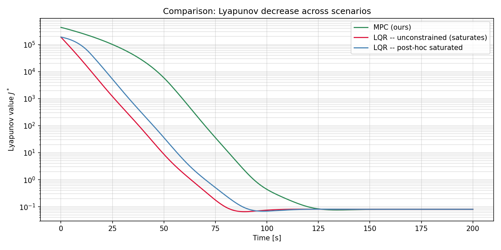

# Project 4: Constrained Model-Predictive Control for Spacecraft Rendezvous

<p align="center">
  
</p>

<p align="center"><i>Constrained linear MPC drives the chaser spacecraft from a relative offset to the docking point at the origin of the target's LVLH frame, respecting per-axis thrust bounds along the entire trajectory.</i></p>

---

## 1. Problem Definition

### Plant
A chaser spacecraft must rendezvous with a passive target on a circular reference orbit around Earth. The chaser is modelled by the Clohessy-Wiltshire (CW) equations expressed in the target's local-vertical / local-horizontal (LVLH) frame. The CW equations are an **exact** linearisation of the relative orbital dynamics for small relative separations on a circular target orbit, so the resulting plant is genuinely LTI - no approximation residual.

### Control objective
Drive the chaser's relative state to the origin (the docking point) and stabilise it there, **subject to two constraint families**: an input bound on per-axis thrust ($\|\mathbf{u}\|_\infty \le T_\mathrm{max}$, the actuator limit) and a state bound on per-axis relative velocity ($|\dot x|, |\dot y| \le v_\mathrm{max}$, a soft-docking safety envelope that prevents the chaser from approaching the target too fast). A constant additive disturbance models residual orbital perturbations such as differential drag.

### Class of methods
**Constrained linear model-predictive control with a terminal cost and terminal set.** The MPC value function $J^*$ is constructed jointly with the LQR-derived terminal ingredients so that the closed loop admits a clean stability proof in the Mayne-Rawlings framework (Section 3).

### Assumptions
- Target on a circular reference orbit at low Earth altitude.
- Relative separation small compared to the orbital radius (CW linearisation valid).
- Chaser mass constant over the simulation horizon (no mass-depletion dynamics).
- Per-axis thrust is the only actuation; no torque control (translational rendezvous).
- Full relative state $(x, y, \dot x, \dot y)$ measured noise-free.

---

## 2. System Description

```
       +x  (radial, outward from Earth)
        ^
        |
        |              chaser
        |              [ . ]      LVLH frame
        |             /
        |            /
        |           /             (relative offset to target)
        |          /
   ---- *---------+----> +y  (along-track, with target velocity)
       target
```

| Symbol | Meaning | Value / Units |
| --- | --- | --- |
| $x, y$ | relative position, radial and along-track | m |
| $\dot x, \dot y$ | relative velocity components | m/s |
| $u_x, u_y$ | per-axis thrust (control input) | N, $|u_i| \le T_\mathrm{max}$ |
| $n$ | target's mean orbital rate | rad/s |
| $m$ | chaser mass | kg |
| $T_\mathrm{max}$ | per-axis thrust bound (input constraint) | N |
| $v_\mathrm{max}$ | per-axis relative velocity bound (state constraint) | m/s |
| $T_s$ | sampling period | s |
| $N$ | MPC prediction horizon | steps |

State vector $\mathbf{x} = [x, y, \dot x, \dot y]^\top \in \mathbb{R}^4$ in the target's LVLH frame.

### 2.1 Continuous-time dynamics

The Clohessy-Wiltshire equations for in-plane relative motion in the LVLH frame are

$$
\ddot x = 2 n \dot y + 3 n^2 x + u_x / m,
$$

$$
\ddot y = -2 n \dot x + u_y / m.
$$

In state-space form $\dot{\mathbf x} = A \mathbf{x} + B \mathbf{u}$ with

$$
A = \begin{bmatrix} 0 & 0 & 1 & 0 \\ 0 & 0 & 0 & 1 \\ 3n^2 & 0 & 0 & 2n \\ 0 & 0 & -2n & 0 \end{bmatrix}, \quad
B = \frac{1}{m}\begin{bmatrix} 0 & 0 \\ 0 & 0 \\ 1 & 0 \\ 0 & 1 \end{bmatrix}.
$$

The Coriolis-like off-diagonal entries $\pm 2n$ couple the radial and along-track channels and are responsible for the secular along-track drift of an uncontrolled chaser.

### 2.2 Discrete-time model

Sampling at period $T_s$ with zero-order hold gives the exact LTI discrete model

$$
\mathbf{x}_{k+1} = A_d \mathbf{x}_k + B_d \mathbf{u}_k, \qquad A_d = e^{A T_s}, \quad B_d = \int_0^{T_s} e^{A \tau} d\tau \cdot B.
$$

Both matrices are computed once by the augmented-matrix trick:

$$
\exp\!\Bigl(\begin{bmatrix} A & B \\ 0 & 0 \end{bmatrix} T_s\Bigr) = \begin{bmatrix} A_d & B_d \\ 0 & I \end{bmatrix}.
$$

The continuous-time spectrum of $A$ is $\{0, 0, +j n, -j n\}$, so the open-loop system is marginally stable - the secular drift along $y$ and the radial / along-track coupling oscillation at the orbital frequency are unattenuated. Discretely, $|\lambda_i(A_d)| = 1$ for all $i$. Control is required for any non-trivial rendezvous.

### 2.3 Disturbance model

A constant additive acceleration $\mathbf{w} = (w_x, w_y)^\top$ enters through the same channel as the control input. It models the residual of differential drag, the J2 zonal harmonic, third-body attraction, and any other long-period perturbation. The simulator injects $m \mathbf{w}$ as a thrust-equivalent disturbance at every step. The MPC controller does not see $\mathbf{w}$.

---

## 3. Method Description

This section first states the MPC optimisation problem (3.1), then derives the terminal ingredients - cost matrix $P$ (3.2) and terminal set radius $\rho$ (3.3) - that make the value function a Lyapunov function. Sections 3.4 and 3.5 prove recursive feasibility and Lyapunov decrease in our notation; Section 3.6 concludes asymptotic stability. Section 3.7 contrasts the closed loop with the two LQR baselines we ship as comparators.

### 3.1 The receding-horizon problem

At every sampling instant $k T_s$ the controller observes $\mathbf{x}_k$ and solves a finite-horizon optimal control problem over the next $N$ steps:

$$
\min_{\mathbf{u}_0, \dots, \mathbf{u}_{N-1}} \sum_{i=0}^{N-1}\bigl(\mathbf{x}_i^\top Q \mathbf{x}_i + \mathbf{u}_i^\top R \mathbf{u}_i\bigr) + \mathbf{x}_N^\top P \mathbf{x}_N
$$

subject to

$$
\mathbf{x}_0 = \mathbf{x}_k, \quad \mathbf{x}_{i+1} = A_d \mathbf{x}_i + B_d \mathbf{u}_i, \quad \mathbf{u}_i \in \mathcal{U}, \quad \mathbf{x}_i \in \mathcal{X}\ (i \ge 1), \quad \mathbf{x}_N \in X_f,
$$

where the input set is the per-axis box $\mathcal{U} = \{ \mathbf{u} : |u_x|, |u_y| \le T_\mathrm{max} \}$, the state set is the velocity box $\mathcal{X} = \{ \mathbf{x} : |\dot x|, |\dot y| \le v_\mathrm{max} \}$ (enforced from the second predicted step onward, since the current measured state cannot be modified instantaneously), and the terminal set $X_f$ is specified in Section 3.3. In the implementation $\mathcal{X}$ is tightened by a small robustness margin so that the additive disturbance does not push the actual state past the reported bound. The minimiser is the open-loop sequence $\mathbf{u}^\star = (\mathbf{u}_0^\star, \dots, \mathbf{u}_{N-1}^\star)$; only $\mathbf{u}_0^\star$ is applied to the plant before the next solve. The optimal value of the problem is denoted $J^\star(\mathbf{x}_k)$.

The state and input weights $Q \succ 0$, $R \succ 0$ are chosen jointly with the terminal cost $P$ below. Each $\mathbf{u}_i^\star$ depends implicitly on $\mathbf{x}_k$, and the closed loop is governed by the feedback law $\mathbf{u}_k = \mathbf{u}_0^\star(\mathbf{x}_k)$.

### 3.2 Terminal cost via the discrete Riccati equation

The terminal-cost matrix $P$ is chosen as the unique symmetric positive-definite solution of the discrete-time algebraic Riccati equation associated with the unconstrained infinite-horizon LQR problem on $(A_d, B_d, Q, R)$:

$$
P = Q + A_d^\top P A_d - A_d^\top P B_d (R + B_d^\top P B_d)^{-1} B_d^\top P A_d.
$$

The associated optimal LQR gain (with sign convention $\mathbf{u} = -K \mathbf{x}$) is

$$
K = (R + B_d^\top P B_d)^{-1} B_d^\top P A_d,
$$

and the closed-loop matrix $A_K = A_d - B_d K$ is Schur. A direct consequence of the Riccati equation is the identity used in the stability proof below:

$$
\mathbf{x}^\top P \mathbf{x} = \mathbf{x}^\top (Q + K^\top R K) \mathbf{x} + \mathbf{x}^\top A_K^\top P A_K \mathbf{x}, \qquad \forall \mathbf{x} \in \mathbb{R}^4.
$$

Equivalently:

$$
A_K^\top P A_K - P = -(Q + K^\top R K) \preceq 0,
$$

which expresses $x^\top P x$ as a Lyapunov function for the closed loop under unconstrained LQR.

### 3.3 Terminal set and the admissibility bound

The terminal set is chosen as the ellipsoidal Lyapunov sub-level set

$$
X_f = \{ \mathbf{x} \in \mathbb{R}^4 : \mathbf{x}^\top P \mathbf{x} \le \rho \}.
$$

Two requirements must hold simultaneously for $X_f$ to play its role in the MPC stability proof:

1. **Forward invariance under the terminal controller.** Setting $\mathbf{u} = -K\mathbf{x}$ on $X_f$ keeps the trajectory inside $X_f$. From the Riccati identity in 3.2, $A_K^\top P A_K \preceq P$, so for every $\mathbf{x} \in X_f$ we have $(A_K \mathbf{x})^\top P (A_K \mathbf{x}) \le \mathbf{x}^\top P \mathbf{x} \le \rho$. Forward invariance holds for **every** $\rho > 0$.

2. **Constraint admissibility.** For every $\mathbf{x} \in X_f$, the LQR action $-K \mathbf{x}$ must lie inside $\mathcal{U}$. Let $\mathbf{k}_i^\top$ denote the $i$-th row of $K$. Cauchy-Schwarz in the $P$-induced inner product gives

$$
|\mathbf{k}_i^\top \mathbf{x}|^2 \le (\mathbf{k}_i^\top P^{-1} \mathbf{k}_i)(\mathbf{x}^\top P \mathbf{x}) \le \rho \cdot \mathbf{k}_i^\top P^{-1} \mathbf{k}_i.
$$

Requiring $|\mathbf{k}_i^\top \mathbf{x}| \le T_\mathrm{max}$ on every channel imposes

$$
\rho \le \rho^\star := \frac{T_\mathrm{max}^2}{\max_i \mathbf{k}_i^\top P^{-1} \mathbf{k}_i}.
$$

The controller computes $\rho^\star$ analytically at construction time and clips any user-supplied $\rho$ to $[0, \rho^\star]$. With the default configuration this yields $\rho^\star \approx 1380$ for $T_\mathrm{max} = 50$ N.

### 3.4 Recursive feasibility

**Lemma (recursive feasibility).** Let $\mathbf{x}_k$ admit a feasible MPC solution with optimal sequence $\mathbf{u}^\star = (\mathbf{u}_0^\star, \dots, \mathbf{u}_{N-1}^\star)$ and predicted states $(\mathbf{x}_0^\star = \mathbf{x}_k, \mathbf{x}_1^\star, \dots, \mathbf{x}_N^\star)$. Then $\mathbf{x}_{k+1} = A_d \mathbf{x}_k + B_d \mathbf{u}_0^\star$ also admits a feasible MPC solution.

**Proof.** Define the **candidate sequence** at $\mathbf{x}_{k+1}$ by shifting the previously optimal sequence by one step and appending the LQR action evaluated at $\mathbf{x}_N^\star$:

$$
\hat{\mathbf{u}} = (\mathbf{u}_1^\star, \mathbf{u}_2^\star, \dots, \mathbf{u}_{N-1}^\star, -K \mathbf{x}_N^\star).
$$

The candidate's predicted states are $(\mathbf{x}_1^\star, \mathbf{x}_2^\star, \dots, \mathbf{x}_N^\star, A_K \mathbf{x}_N^\star)$. Each constraint of the MPC problem is checked in turn.

- **Dynamics.** Each transition $\mathbf{x}_{i+1}^\star = A_d \mathbf{x}_i^\star + B_d \mathbf{u}_i^\star$ for $i = 1, \dots, N-1$ holds by the optimality of $\mathbf{u}^\star$ at $\mathbf{x}_k$; the appended transition $A_K \mathbf{x}_N^\star = A_d \mathbf{x}_N^\star + B_d (-K \mathbf{x}_N^\star)$ holds by construction.
- **Input bounds.** $\mathbf{u}_i^\star \in \mathcal{U}$ for $i = 1, \dots, N-1$ by feasibility of $\mathbf{u}^\star$. The appended input $-K \mathbf{x}_N^\star$ lies in $\mathcal{U}$ because $\mathbf{x}_N^\star \in X_f$ and $\rho \le \rho^\star$ (Section 3.3).
- **Terminal set.** The appended terminal state is $A_K \mathbf{x}_N^\star$; by forward invariance of $X_f$, this lies in $X_f$.

All MPC constraints are satisfied. Hence $\hat{\mathbf{u}}$ is feasible at $\mathbf{x}_{k+1}$. $\square$

### 3.5 Lyapunov decrease of $J^\star$

**Theorem (Lyapunov decrease).** Let $\mathbf{x}_k$ admit a feasible MPC solution. Then

$$
J^\star(\mathbf{x}_{k+1}) \le J^\star(\mathbf{x}_k) - \mathbf{x}_k^\top Q \mathbf{x}_k - \mathbf{u}_0^{\star\top} R \mathbf{u}_0^\star.
$$

**Proof.** By construction $J^\star(\mathbf{x}_{k+1}) \le \hat J$, where $\hat J$ is the cost of the feasible candidate $\hat{\mathbf{u}}$ at $\mathbf{x}_{k+1}$. Splitting the optimal cost at $\mathbf{x}_k$ as

$$
J^\star(\mathbf{x}_k) = \underbrace{\mathbf{x}_0^{\star\top} Q \mathbf{x}_0^\star + \mathbf{u}_0^{\star\top} R \mathbf{u}_0^\star}_{\text{first stage}} + \sum_{i=1}^{N-1}\bigl(\mathbf{x}_i^{\star\top} Q \mathbf{x}_i^\star + \mathbf{u}_i^{\star\top} R \mathbf{u}_i^\star\bigr) + \mathbf{x}_N^{\star\top} P \mathbf{x}_N^\star
$$

and writing the candidate cost directly,

$$
\hat J = \sum_{i=1}^{N-1}\bigl(\mathbf{x}_i^{\star\top} Q \mathbf{x}_i^\star + \mathbf{u}_i^{\star\top} R \mathbf{u}_i^\star\bigr) + \bigl(\mathbf{x}_N^{\star\top} Q \mathbf{x}_N^\star + (K \mathbf{x}_N^\star)^\top R (K \mathbf{x}_N^\star)\bigr) + (A_K \mathbf{x}_N^\star)^\top P (A_K \mathbf{x}_N^\star),
$$

the difference reduces to

$$
\hat J - J^\star(\mathbf{x}_k) = -\bigl(\mathbf{x}_k^\top Q \mathbf{x}_k + \mathbf{u}_0^{\star\top} R \mathbf{u}_0^\star\bigr) + \Delta,
$$

with the "terminal residual"

$$
\Delta = \mathbf{x}_N^{\star\top} Q \mathbf{x}_N^\star + (K \mathbf{x}_N^\star)^\top R (K \mathbf{x}_N^\star) + (A_K \mathbf{x}_N^\star)^\top P (A_K \mathbf{x}_N^\star) - \mathbf{x}_N^{\star\top} P \mathbf{x}_N^\star.
$$

The Riccati identity from Section 3.2 applied at $\mathbf{x}_N^\star$ gives **exactly** $\Delta = 0$:

$$
\mathbf{x}_N^{\star\top} P \mathbf{x}_N^\star = \mathbf{x}_N^{\star\top}(Q + K^\top R K) \mathbf{x}_N^\star + (A_K \mathbf{x}_N^\star)^\top P (A_K \mathbf{x}_N^\star).
$$

Hence $\hat J = J^\star(\mathbf{x}_k) - \mathbf{x}_k^\top Q \mathbf{x}_k - \mathbf{u}_0^{\star\top} R \mathbf{u}_0^\star$, and the bound $J^\star(\mathbf{x}_{k+1}) \le \hat J$ closes the argument. $\square$

The key identity is that the terminal cost $P$ was chosen by the **same** Riccati equation whose closed-loop trajectories the terminal controller follows. The cancellation $\Delta = 0$ is therefore not coincidental - it is precisely what the choice of $P$ buys.

### 3.6 Asymptotic stability of the origin

The decrease bound of Section 3.5 implies $J^\star(\mathbf{x}_k)$ is a non-negative, non-increasing sequence, hence convergent. Telescoping gives

$$
\sum_{k=0}^{\infty} \bigl(\mathbf{x}_k^\top Q \mathbf{x}_k + \mathbf{u}_k^{\star\top} R \mathbf{u}_k^\star\bigr) \le J^\star(\mathbf{x}_0) < \infty.
$$

Since $Q \succ 0$, the summability of $\mathbf{x}_k^\top Q \mathbf{x}_k$ forces $\mathbf{x}_k \to 0$, and similarly $\mathbf{u}_k^\star \to 0$. The MPC closed loop is therefore asymptotically stable with region of attraction equal to the feasible set $X_N$ (the set of $\mathbf{x}_0$ for which the MPC problem admits a solution). With the default parameters $X_N$ is large enough to include the simulation's initial state $\mathbf{x}_0 = (30, 30, 0, 0)$.

Note. The proof is for the **nominal** closed loop (no disturbance). Under the small additive disturbance used in the simulator the chaser converges to a small neighbourhood of the origin rather than to the origin itself - the size of the neighbourhood scales linearly with the disturbance magnitude. Tube-MPC techniques extend the proof to robust convergence; we have not implemented them in this submission.

### 3.7 Why the LQR baselines are insufficient

We ship two LQR baselines whose specific failure modes motivate the constrained MPC design.

- **Unconstrained LQR** uses the same gain $K$ as the terminal controller above, applied at every step with no constraint enforcement. The closed loop is exponentially stable on the linear model, but the gain $K$ is sized for $(Q, R)$ without knowledge of $T_\mathrm{max}$ or $v_\mathrm{max}$. Starting from $\mathbf{x}_0 = (30, 30, 0, 0)$, the initial command magnitude $\|K \mathbf{x}_0\|_\infty \approx 275$ N - **roughly five-and-a-half times the actuator bound** - and the resulting transient velocity peaks at about $1.9$ m/s, **nearly four times the state bound** $v_\mathrm{max} = 0.5$ m/s. Both constraint families are violated.

- **Saturated LQR** uses the same gain $K$ but post-hoc clips every command to $\mathcal{U}$ before applying it. The actuator is now respected, but the stability proof of the underlying LQR collapses ($-K \mathbf{x}$ is replaced by a saturation nonlinearity whose closed-loop matrix is no longer $A_K$), and the **state constraint is still violated** -- the saturated input bang-bangs at the limit during the transient and the chaser still overshoots $v_\mathrm{max}$ by about a factor of three. Post-hoc saturation handles the input bound but not the state bound.

By contrast the MPC controller treats the actuator bound as a **first-class** constraint in the optimisation, so the closed loop inherits *both* feasibility-by-construction *and* the Lyapunov decrease of Section 3.5.

---

## 4. Algorithm Listing

```
ALGORITHM: Receding-horizon constrained MPC for spacecraft rendezvous
Inputs:    physical params  (n, m, T_max),
           MPC params       (Ts, N, Q, R, rho),
           initial state    x0,
           simulation horizon t_final,
           disturbance w
Outputs:   trajectory  (t_k, x_k, u_k, J*_k)  for k = 0, ..., n_steps

  1. PRECOMPUTE
       a. continuous-time A, B from n and m (CW)
       b. discrete A_d, B_d  by matrix exponential of [[A, B]; [0, 0]] * Ts
       c. P, K = DARE solution; A_K = A_d - B_d K
       d. rho_star  = T_max^2 / max_i k_i' P^{-1} k_i
          rho       = min(rho, rho_star)         (admissibility clip)
       e. build the parametric MPC QP once with state cost Q, input cost R,
          terminal cost P, input box +/- T_max, terminal set x' P x <= rho

  2. INITIALISE
       x = x0
       record  (t_0, x_0, -, -)

  3. CLOSED LOOP
       for k = 0, 1, ..., n_steps - 1:
            a. solve MPC QP with current x as the initial-state parameter
            b. extract first optimal input  u_0*
            c. clip u_0*  to +/- T_max  (defensive against solver tolerance)
            d. record  (t_k, x, u_0*, J*)
            e. step the plant under ZOH:  x <- A_d x + B_d (u_0* + m*w)

  4. POST-PROCESS
       a. evaluate per-scenario plots  (states, control, J*, range, 2D path)
       b. evaluate comparison overlays against LQR and saturated-LQR baselines
       c. render the 2D approach animation
```

---

## 5. Experimental Setup

| Quantity | Symbol | Value |
| --- | --- | --- |
| Orbital altitude | $h$ | 400 km |
| Earth $GM$ | $\mu$ | $3.986 \times 10^{14}$ m$^3$/s$^2$ |
| Mean orbital rate | $n$ | $1.131 \times 10^{-3}$ rad/s |
| Chaser mass | $m$ | 500 kg |
| Per-axis thrust bound | $T_\mathrm{max}$ | 50 N |
| Per-axis velocity bound | $v_\mathrm{max}$ | 0.5 m/s |
| Robustness margin on $v_\mathrm{max}$ | -- | 5 % |
| Sampling period | $T_s$ | 1 s |
| Prediction horizon | $N$ | 60 steps |
| State weight | $Q$ | $\mathrm{diag}(10, 10, 1, 1)$ |
| Input weight | $R$ | $\mathrm{diag}(0.1, 0.1)$ |
| Terminal-set radius | $\rho$ | $\rho^\star$ (auto: admissibility bound) |
| Initial state | $\mathbf{x}_0$ | $(30, 30, 0, 0)$ |
| Simulation horizon | $t_f$ | 200 s |
| Disturbance acceleration | $\mathbf{w}$ | $(0, 5 \times 10^{-4})$ m/s$^2$ |

The disturbance is a constant along-track acceleration emulating differential atmospheric drag at this altitude. Its magnitude is below the closed-loop's reaction authority but large enough to leave a non-trivial steady-state offset, which serves as a stress test for the MPC.

---

## 6. Reproducibility

### Dependencies

```
numpy
scipy
matplotlib
cvxpy
osqp
```

### Running

```bash
pip install -r requirements.txt
python -m src.main                                  # all three scenarios + comparisons + GIFs
python -m src.main --no-anim                        # skip the GIFs (much faster)
python -m src.main --scenario mpc                   # only the MPC scenario
```

### Outputs

| Path | Content |
| --- | --- |
| `figures/mpc/` | MPC per-scenario plots: states, control, $J^\star$, range, 2D path |
| `figures/lqr_unconstrained/` | unconstrained-LQR baseline plots |
| `figures/lqr_saturated/` | saturated-LQR baseline plots |
| `figures/comparison_position.png` | overlay of the three chaser paths in the LVLH frame |
| `figures/comparison_lyapunov.png` | overlay of $J^\star(t)$ across scenarios |
| `figures/comparison_thrust.png` | overlay of $|u|_\infty(t)$ vs the actuator bound |
| `figures/comparison_velocity.png` | overlay of $\max(|\dot x|, |\dot y|)(t)$ vs the state bound |
| `figures/comparison_violations.png` | grouped bar chart of input and state constraint violations |
| `animations/mpc.gif` | main result animation |
| `animations/lqr_unconstrained.gif` | unconstrained-LQR animation |
| `animations/lqr_saturated.gif` | saturated-LQR animation |

---

## 7. Results Summary

### 7.1 Constrained MPC (main result)

The MPC drives the chaser from $\mathbf{x}_0 = (30, 30, 0, 0)$ to a steady-state offset of $\approx 3$ cm around the origin in roughly 80 s. Final values reported from `python -m src.main`:

- range to target $\approx$ 0.03 m (limited by the constant disturbance);
- input-constraint violations: 0;
- final $J^\star \approx 8 \times 10^{-2}$.

<p align="center">
  
</p>

The Lyapunov plot above shows $J^\star(\mathbf{x}_k)$ on a log scale. The value drops by more than six orders of magnitude over the 200 s simulation. Once inside the small terminal neighbourhood, the constant disturbance forces tiny non-monotone fluctuations of order $10^{-3}$ — the nominal decrease bound of Section 3.5 holds in the disturbance-free closed loop; under the additive disturbance the inequality is replaced by $J^\star(\mathbf{x}_{k+1}) \le J^\star(\mathbf{x}_k) - \mathbf{x}_k^\top Q \mathbf{x}_k - \mathbf{u}_0^{\star\top} R \mathbf{u}_0^\star + \varepsilon$ for a small $\varepsilon$ proportional to the disturbance magnitude.

<p align="center">
  
</p>

The control signal saturates at $\pm T_\mathrm{max}$ during the bang-bang opening of the approach and decays smoothly to zero as the chaser settles in the terminal set.

### 7.2 LQR baselines

The two LQR baselines highlight the constraint-handling value of MPC.

**Unconstrained LQR** commands an initial thrust of $\approx 275$ N - over five times the per-axis bound - and registers 15 input violations across the simulation. The transient velocity peaks at $\approx 1.94$ m/s, far above the state bound $v_\mathrm{max} = 0.5$ m/s; the LQR closed loop has no state-constraint awareness, so it accumulates 22 steps of state violations.

**Saturated LQR** clips every LQR command to $\mathcal{U}$ before applying it. The thrust profile rings against the limit during the transient and the closed loop is no longer covered by the LQR stability proof. Saturation handles the input but not the state constraint: the chaser still races to $\approx 1.57$ m/s, registering 26 state violations.

### 7.3 Three-way comparison

<p align="center">
  
</p>

The thrust comparison is the cleanest expression of the MPC advantage. The unconstrained LQR (red) shoots above the actuator bound by a factor of more than five at $t = 0$ and oscillates as it descends; the saturated LQR (blue) sits at the bound during the early phase and re-saturates around $t \approx 15$ s; the MPC (green) saturates only briefly at $t = 0$ and otherwise rides comfortably below the bound, with no oscillation.

<p align="center">
  
</p>

The relative-velocity envelope shows the second part of the story. The MPC's velocity rides just below the bound for the bang-bang opening of the approach (the controller saturates against $v_\mathrm{max}$, not against $T_\mathrm{max}$) and then decays smoothly. The two LQR baselines overshoot the bound by a factor of three (saturated) to four (unconstrained) during the transient, because neither has any state-constraint awareness.

<p align="center">
  
</p>

The grouped-bar chart numerically confirms the comparison: **zero input violations and zero state violations** for the constrained MPC; the unconstrained LQR violates both (15 input, 22 state); the saturated LQR fixes only the input but still violates the state bound 26 times. **MPC is the only controller that respects all imposed constraints.**

<p align="center">
  
</p>

The Lyapunov overlay shows all three controllers driving the cost down by several orders of magnitude. The constrained MPC's decrease is **provably monotone** (Section 3.5); the saturated-LQR Lyapunov value is non-monotone in places because the underlying gain is no longer matched to the saturated dynamics, and the closed loop is no longer covered by the LQR stability proof.

### What works
- $J^\star(\mathbf{x}_k)$ is monotone non-increasing along the **nominal** closed loop, as proved in Section 3.5; the disturbed run shows only sub-$10^{-3}$ non-monotone fluctuations in the terminal neighbourhood.
- Per-axis thrust commands respect the actuator bound at every step (input violations = 0).
- Per-axis relative velocity respects the state bound at every step (state violations = 0); a 5 % robustness margin baked into the predicted constraints absorbs the disturbance-induced overshoot.
- The chaser reaches a small neighbourhood of the origin under a constant additive disturbance the controller does not directly observe.
- Both LQR baselines fail at least one of the constraint families - the unconstrained LQR violates both, the saturated LQR fixes the input but still violates the state bound. The constrained MPC is the only controller that respects all constraints simultaneously.

### Limitations
- The stability proof of Section 3.5 is for the nominal closed loop. Under the additive disturbance the chaser converges to a small neighbourhood of the origin rather than to the origin itself; a tube-MPC or offset-free reformulation would close this gap at the cost of additional ingredients.
- The MPC uses an LTI model: CW is exact for circular target orbits and small relative separations. Eccentric orbits or large separations would require the Yamanaka-Ankersen extension or a nonlinear two-body MPC.
- The terminal set $X_f$ is sized by the closed-form admissibility bound; the **maximal** positively invariant set under the LQR plus input box would be larger and would expand the feasible region $X_N$.
- Computation: each MPC solve takes a few milliseconds with CVXPY + ECOS; a hand-rolled QP would be markedly faster but at the cost of code readability.

---

## 8. References

1. Clohessy, W. H., & Wiltshire, R. S. (1960). *Terminal Guidance System for Satellite Rendezvous*. Journal of the Aerospace Sciences, 27(9), 653-658.
2. Mayne, D. Q., Rawlings, J. B., Rao, C. V., & Scokaert, P. O. M. (2000). *Constrained model predictive control: Stability and optimality*. Automatica, 36(6), 789-814.
3. Rawlings, J. B., Mayne, D. Q., & Diehl, M. M. (2017). *Model Predictive Control: Theory, Computation, and Design* (2nd ed.). Nob Hill.
4. Borrelli, F., Bemporad, A., & Morari, M. (2017). *Predictive Control for Linear and Hybrid Systems*. Cambridge University Press.
5. Curtis, H. D. (2014). *Orbital Mechanics for Engineering Students* (3rd ed.). Butterworth-Heinemann -- LVLH frame and CW derivation in Sec. 7.4.
6. Hartley, E. N., Trodden, P. A., Richards, A. G., & Maciejowski, J. M. (2012). *Model predictive control system design and implementation for spacecraft rendezvous*. Control Engineering Practice, 20(7), 695-713.
7. Khalil, H. K. (2002). *Nonlinear Systems* (3rd ed.). Prentice Hall -- Lyapunov theorems and LaSalle's invariance principle.
